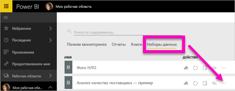
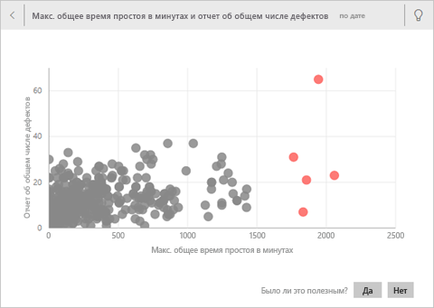
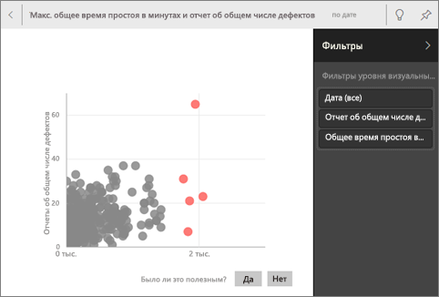
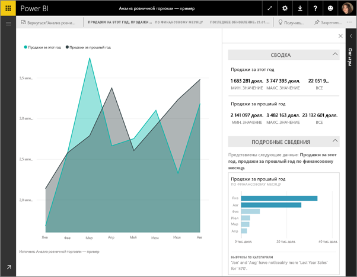

# Автоматическое создание аналитических сведений с помощью Power BI
Вы получили новый набор данных и не знаете, с чего начать?  Вам нужно быстро создать панель мониторинга?  Хотите найти полезные данные, которые вы могли пропустить?

Краткая аналитика позволяет получить интересные интерактивные визуализации на основе имеющихся данных. Краткую аналитику можно выполнить для всего набора данных (краткая аналитика) или для отдельной плитки панели мониторинга (краткая аналитика с заданной областью). Вы даже можете анализировать полученные результаты.

> **Примечание.** Аналитика не работает с DirectQuery — только с данными, отправленными в Power BI.
> 
> 

Функция аналитики основана на постоянно пополняемом [наборе усовершенствованных аналитических алгоритмов](service-insight-types.md), разработанных при сотрудничестве с подразделением Microsoft Research, которые мы продолжаем использовать, чтобы все больше людей могли анализировать данные новыми удобными способами.

## Запуск краткой аналитики для набора данных
Узнайте, как Аманда выполняет аналитику для набора данных, открывает аналитику в режиме фокусировки, закрепляет один из результатов в виде плитки на своей панели мониторинга, а затем получает результаты аналитики для панели мониторинга.

<iframe width="560" height="315" src="https://www.youtube.com/embed/et_MLSL2sA8" frameborder="0" allowfullscreen></iframe>

Теперь ваша очередь. Узнайте, как работает аналитика данных, на примере [Анализ качества поставщика](sample-supplier-quality.md).

1. На вкладке **Наборы данных** щелкните многоточие (…) и выберите **Получить аналитику**.
   
    
   
    
2. Для поиска тенденций в наборе данных Power BI использует [различные алгоритмы](service-insight-types.md).
   
    
3. Анализ занимает несколько секунд.  Нажмите кнопку **Просмотреть аналитику**, чтобы отобразить визуализации.
   
    
   
   > **Примечание.** Для некоторых данных аналитические сведения не формируются, так как информация не является статистически значимой.  Дополнительные сведения см. в статье [Оптимизация данных для быстрого анализа данных в Power BI](service-insights-optimize.md).
   > 
   > 
1. Визуализация отображается на специальном холсте **краткой аналитики**, который может вмещать до 32 отдельных карт анализа. Каждая карта имеет диаграмму или график, а также краткое описание.
   
    

## Работа с карточками аналитики
  

1. Наведите указатель мыши на карту и выберите значок булавки, чтобы добавить визуализацию на панель мониторинга.
2. Наведите указатель мыши на карточку, щелкните многоточие (…) и выберите пункт **Просмотреть аналитические сведения**. Откроется представление аналитики в полноэкранном режиме.
   
    
3. В режиме фокусировки можно выполнять следующие задачи.
   
   * Фильтровать визуализации.  Чтобы отобразить фильтры, в правом верхнем углу экрана выберите стрелку для развертывания панели "Фильтры".
        
   * Закрепите карточку анализа на панели мониторинга, выбрав значок закрепления  или **визуальный элемент закрепления**.
   * Запустите аналитику для самой карточки. Часто это называют **аналитикой с заданной областью**. В правом верхнем углу щелкните значок лампочки  или нажмите **Get insights** (Получить аналитику).
     
       
     
     Результаты аналитики отображаются слева, а справа отображаются новые карточки, основанные только на данных этой аналитики.
     
       
4. Чтобы вернуться к первоначальному холсту аналитики, щелкните в верхнем левом углу **Выйти из режима фокусировки**.

## Запуск аналитики для плитки панели мониторинга
Вместо поиск аналитических данных по всему набору данных сузьте область поиска до данных, используемых для создания отдельной плитки панели мониторинга. Часто это также называют **аналитикой с заданной областью**.

1. Откройте панель мониторинга.
2. Наведите указатель мыши на плитку. Щелкните многоточие (…) и выберите пункт **Просмотреть аналитические сведения**. Плитка откроется в [режиме фокусировки](service-focus-mode.md) с карточками аналитики, которые отображаются с правой стороны.    
   
        
4. Вас заинтересовали эти сведения? Выберите карту анализа, чтобы ознакомиться с ними детально. Данные выбранного анализа отображаются слева, а справа отображаются новые карты анализа, основанные только на данных этого анализа.    
6. Продолжайте анализировать данные, а при нахождении интересных сведений закрепите их на панели мониторинга, выбрав **Закрепить визуальный элемент** в правом верхнем углу.

## Дальнейшие действия
Если у вас есть набор данных, [оптимизируйте его для краткой аналитики](service-insights-optimize.md).

См. дополнительные сведения о доступных [типах краткой аналитики](service-insight-types.md).

Появились дополнительные вопросы? [Ответы на них см. в сообществе Power BI.](http://community.powerbi.com/)

