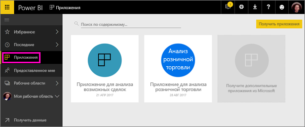
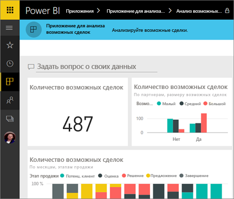
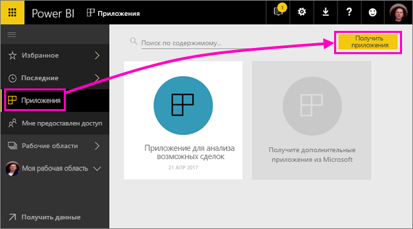
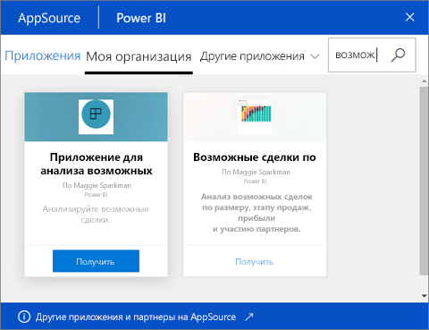
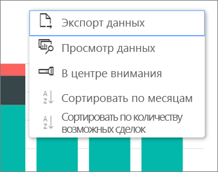

# Установка и использование приложений с информационными панелями и отчетами в Power BI
*Приложения* в Power BI позволяют объединить связанные панели мониторинга и отчеты в одном решении. Сотрудники организации могут создавать и распространять приложения с важной бизнес-информацией. [Внешние службы](service-connect-to-services.md), такие как Google Analytics и Microsoft Dynamics CRM, которые вы, вероятно, уже используете, также поддерживают приложения Power BI. 

Вы можете легко находить и устанавливать приложения в службе Power BI ([https://powerbi.com](https://powerbi.com)) и на мобильном устройстве. Установив приложение, вам не нужно запоминать имена разных панелей мониторинга, так как все они находятся в приложении, в браузере или на мобильном устройстве.

В приложении все выпущенные автором обновления отображаются автоматически. Автор также контролирует график обновления данных, и вам не нужно беспокоиться об их актуальности. 

Планируете создать приложение? Для получения дополнительной информации см. статью [Создание и публикация приложений с информационными панелями и отчетами в Power BI](service-create-distribute-apps.md).

## Получение нового приложения
Приложения можно получить несколькими способами. Создатель приложения может автоматически установить приложение в вашу учетную запись Power BI или отправить вам прямую ссылку на приложение. Кроме того, вы можете найти его в AppSource, где доступны все приложения, к которым можете получить доступ. В Power BI на мобильном устройстве вы можете установить приложение только по прямой ссылке, но не из AppSource. Если создатель приложения автоматически установит приложение, вы увидите его в своем списке приложений.

### Установка приложения по прямой ссылке
Простейший путь установить новое приложение самостоятельно — это получить прямую ссылку на приложение от его создателя. Power BI создает ссылку для установки, которую автор может отправить вам.

**На компьютере** 

Если щелкнуть эту ссылку в письме, служба Power BI ([https://powerbi.com](https://powerbi.com)) откроется в браузере. Вы подтверждаете установку, после чего откроется целевая страница приложения.

**На мобильном устройстве iOS или Android** 

Если щелкнуть ссылку в письме на мобильном устройстве, приложение устанавливается автоматически и открывается список его содержимого. 

### Получение приложения из Microsoft AppSource
Кроме того, вы можете найти в Microsoft AppSource и установить любые приложения, к которым у вас есть доступ. 

1. Последовательно выберите **Приложения**  > **Get apps** (Получить приложения). 
   
     
2. Вы можете выполнить поиск в AppSource в разделе **Моя организация**, чтобы сократить количество результатов и найти необходимое приложение.
   
     
3. Выберите **Получить**, чтобы добавить его на страницу "Приложения". 

## Взаимодействие с панелями мониторинга и отчетами в приложении
Теперь вы можете просмотреть данные информационных панелей и отчетов в приложении. Вам доступны все стандартные возможности взаимодействия Power BI, такие как фильтрация, выделение, сортировка и детализация. Ознакомьтесь со [сведениями о взаимодействии с отчетами в Power BI](service-reading-view-and-editing-view.md). 

Вы не можете сохранять внесенные изменения, но данные из таблицы или других визуальных элементов в отчете всегда можно [экспортировать в Excel](power-bi-visualization-export-data.md).

## Дальнейшие действия
* [Создание и публикация приложений с информационными панелями и отчетами в Power BI](service-create-distribute-apps.md)
* [Приложения Power BI для внешних служб](service-connect-to-services.md)
* У вас появились вопросы? [Попробуйте задать вопрос в сообществе Power BI.](http://community.powerbi.com/)

