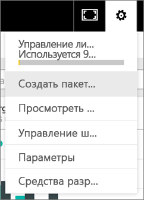
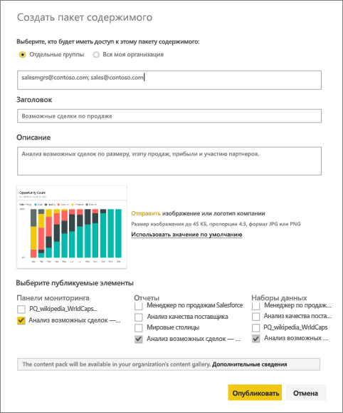
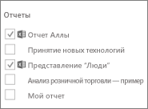
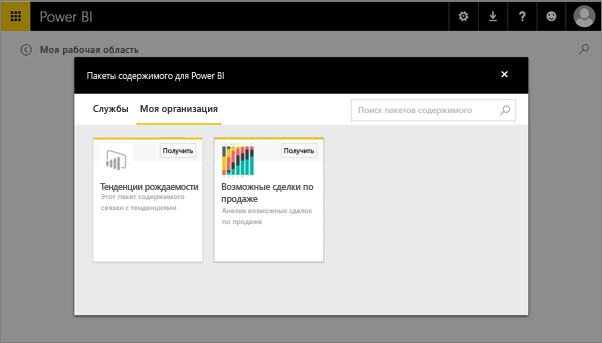

# Создание и публикация пакета содержимого организации в Power BI (руководство)

В этом руководстве вы создадите пакет содержимого организации, предоставите доступ к нему определенной группе и опубликуете его в библиотеке пакетов содержимого своей организации в Power BI.

Создание пакетов содержимого отличается от предоставления общего доступа к информационным панелям и от совместной работы над ними в группе. Чтобы выбрать оптимальный вариант для вашей ситуации, см. статью [Как предоставить общий доступ к панелям мониторинга, отчетам и плиткам?](service-how-to-collaborate-distribute-dashboards-reports.md)

Создание пакета контента организации требует, чтобы у вас и ваших коллег была [учетная запись Power BI Pro](https://powerbi.microsoft.com/pricing). 

> [!NOTE]
> Нельзя создавать или устанавливать пакеты содержимого организации в предварительной версии нового интерфейса рабочей области. Сейчас самое время обновить пакеты содержимого для приложений, если вы еще этого не сделали. Узнайте [больше о новом интерфейсе рабочей области](service-create-the-new-workspaces.md).
> 

Предположим, вы менеджер по выпускам в компании Contoso и готовитесь к запуску нового продукта.  Вы создали панель мониторинга и отчеты, которыми хотели бы поделиться с другими сотрудниками, управляющими запуском. Вам нужно сделать панель мониторинга и отчеты решением, которым смогут пользоваться ваши коллеги. 

Хотите попробовать? В [службе Power BI](https://powerbi.com) последовательно выберите элементы **Получить данные > Примеры > Анализ возможностей — пример** > **Подключение** для получения собственной копии. 

1. В левой области навигации выберите информационную панель **Анализ возможных сделок — пример** , чтобы добавить ее в пакет содержимого.
2. В верхней строке навигации щелкните значок шестеренки, а затем выберите  > **Создать пакет содержимого**.    
   
3. В окне **Создание пакета контента** введите следующие сведения.  
   
   Имейте в виду, что в библиотеке пакетов содержимого вашей организации могут оказаться сотни пакетов, опубликованных для использования в организации или группах. Выделите время, чтобы присвоить пакету содержимого понятное имя, добавить хорошее описание и выбрать правильную аудиторию.  Используйте слова, которые облегчат поиск пакета.
   
   1. Выберите **Отдельные группы** и введите адреса электронной почты сотрудников, [групп Office 365](https://support.office.com/article/Create-a-group-in-Office-365-7124dc4c-1de9-40d4-b096-e8add19209e9), групп рассылки или групп безопасности. Например:
      
        salesmgrs@contoso.com; sales@contoso.com
      
      В этом учебнике используйте свой собственный адрес электронной почты или адрес своей группы.
   
   2. Присвойте пакету контента имя **Возможности продаж**.
   
      > [!TIP]
      > Имя панели мониторинга можно добавить в имя пакета содержимого. В этом случае вашим коллегам будет легче найти панель управления после того, как они подключатся к пакету содержимого.
      > 
      > 
   
   3. Рекомендуется: добавьте **описание**. Это позволит вашим сотрудникам легко найти нужный им пакет контента. Помимо описания добавьте ключевые слова, которые ваши коллеги могут использовать для поиска этого пакета содержимого. Наконец, включите контактную информацию, которая потребуется, если у ваших коллег возникнут вопросы или им понадобится ваша помощь.
   
   4. **Добавьте изображение или эмблему**, чтобы облегчить поиск пакета содержимого членами группы: проще найти изображение, чем искать текст. Ниже приведен снимок плитки гистограммы "Opportunity Count 100%" (Число стопроцентных возможностей).
   
   5. Щелкните панель мониторинга **Анализ возможностей — пример** , чтобы добавить его в пакет контента.  Power BI автоматически добавит связанный отчет и набор данных. При необходимости можно добавить другие отчеты и наборы данных.
   
      > [!NOTE]
      >  Перечислены только панели мониторинга, отчеты, наборы данных и книги, которые вы можете изменять. Поэтому все панели мониторинга и отчеты, к которым вам был предоставлен общий доступ, отсутствуют в списке.
      > 
      > 
   
       
   
   6. При наличии книг Excel они отображаются в области отчетов со значком Excel. Их также можно добавить в пакет содержимого.
   
      
   
      > [!NOTE]
      > Если члены группы не могут просмотреть книгу Excel, возможно, вам потребуется [опубликовать для них эту книгу в OneDrive для бизнеса](https://support.office.com/en-us/article/Share-documents-or-folders-in-Office-365-1fe37332-0f9a-4719-970e-d2578da4941c).
      > 
      > 
4. Нажмите кнопку **Опубликовать** для добавления пакета контента в библиотеку пакетов контента организации для группы.  
   
   При успешной публикации появится сообщение об успешном выполнении. 
5. Когда члены группы выберут **Получить данные > Моя организация**, они введут в поле поиска Sales Opportunities (Возможности продаж).
   
    
6. Они увидят ваш пакет содержимого.  
    
   
   > [!TIP]
   > URL-адрес, отображаемый в браузере, — это уникальный адрес для данного пакета содержимого.  Хотите сообщить об этом новом пакете контента вашим коллегам?  Вставьте URL-адрес в сообщение электронной почты.
   > 
   > 
7. Они нажимают кнопку **Подключить** и могут затем [просматривать ваш пакет содержимого и работать с ним](service-organizational-content-pack-copy-refresh-access.md). 

### Дальнейшие действия
* [Знакомство с пакетами содержимого организации](service-organizational-content-pack-introduction.md)  
* [Управление пакетами содержимого организации, их обновление и удаление в Power BI](service-organizational-content-pack-manage-update-delete.md)  
* [Создание группы в Power BI](service-create-distribute-apps.md)  
* [Что такое OneDrive для бизнеса?](https://support.office.com/en-us/article/What-is-OneDrive-for-Business-187f90af-056f-47c0-9656-cc0ddca7fdc2)
* Появились дополнительные вопросы? [Ответы на них см. в сообществе Power BI.](http://community.powerbi.com/)

