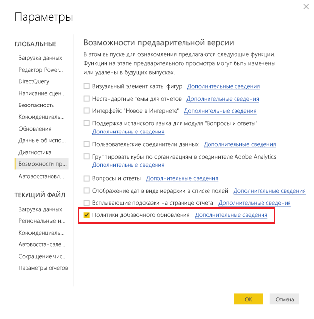
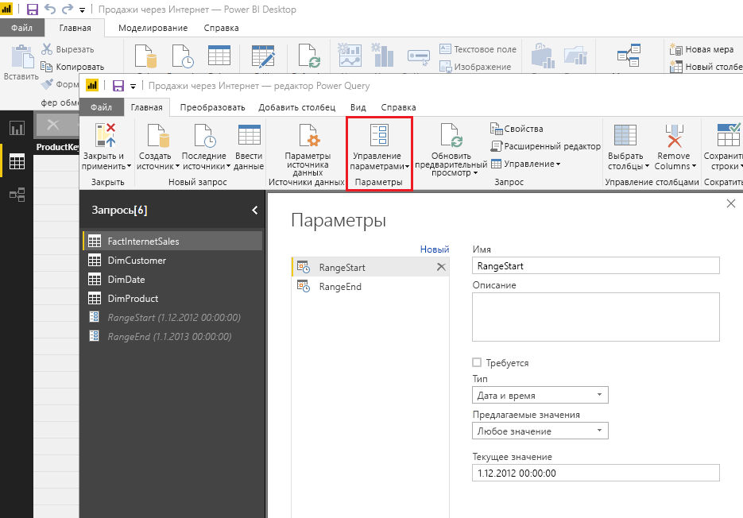
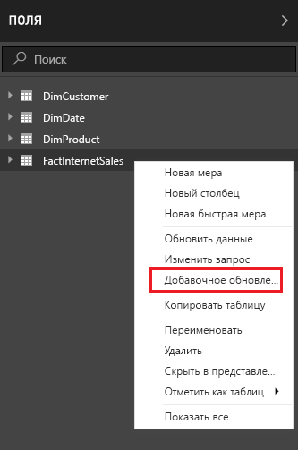
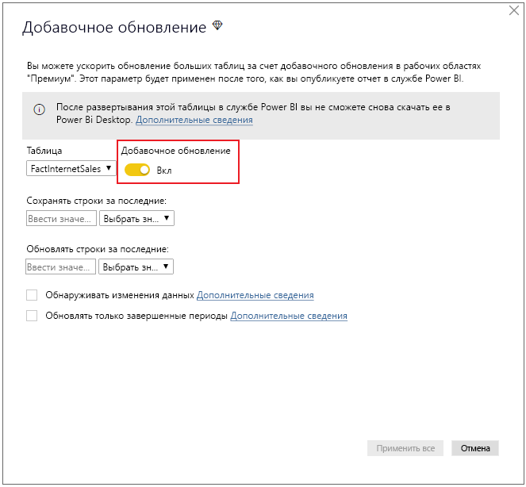
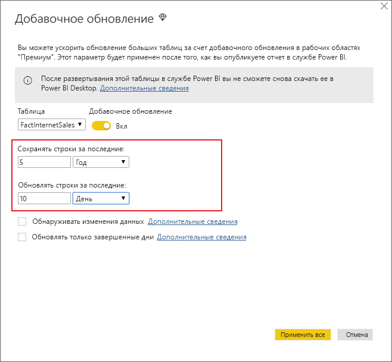
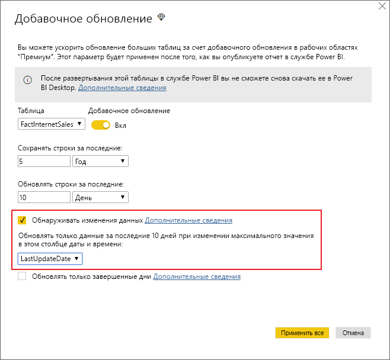
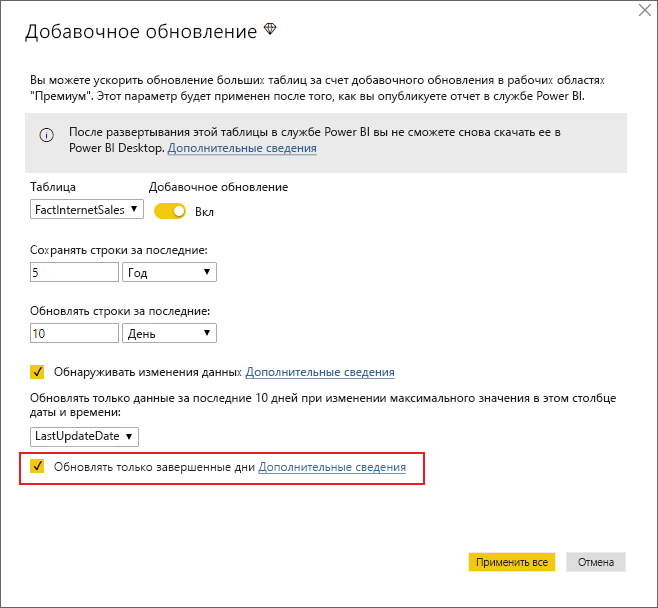
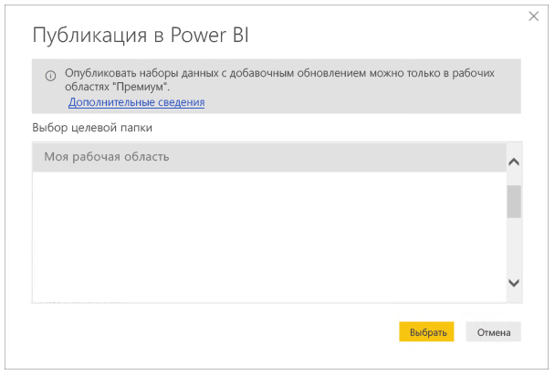

# <a name="incremental-refresh-in-power-bi-premium"></a>Добавочное обновление в Power BI Premium

Добавочное обновление дает указанные ниже преимущества при работе с очень большими наборами данных в службе Power BI Premium.

- **Обновления выполняются быстрее.** Обновлять требуется только изменившиеся данные. Например, в наборе данных за 10 лет могут обновляться данные только за последние пять дней.

- **Обновление производится более надежно.** Например, нет необходимости надолго подключаться к нестабильным исходным системам.

- **Снижено потребление ресурсов.** Так как обновлять требуется меньше данных, сокращается общее потребление памяти и других ресурсов.

## <a name="how-to-use-incremental-refresh"></a>Использование добавочного обновления

Политики добавочного обновления определяются в Power BI Desktop и применяются после публикации в службе Power BI.

Сначала включите добавочное обновление в функциях предварительной версии.



### <a name="filter-large-datasets-in-power-bi-desktop"></a>Фильтрация больших наборов данных в Power BI Desktop

Большие наборы данных, насчитывающие миллиарды строк, могут не помещаться в Power BI Desktop, так как возможности этого приложения обычно ограничены ресурсами, имеющимися на компьютере пользователя. Поэтому, как правило, они фильтруются при импорте в Power BI Desktop. Это происходит вне зависимости от использования добавочного обновления.

#### <a name="rangestart-and-rangeend-parameters"></a>Параметры RangeStart и RangeEnd

Для использования добавочного обновления в службе Power BI необходимо выполнить фильтрацию с помощью параметров даты и времени Power Query с зарезервированными именами **RangeStart** и **RangeEnd**, в которых учитывается регистр.

После публикации значения параметров переопределяются автоматически службой Power BI. Задавать их в параметрах набора данных службы не нужно.

Важно, чтобы на момент отправки запросов для операций обновления фильтр был отправлен в исходную систему. Это значит, что источник данных должен поддерживать "свертывание запроса". Большинство источников данных, которые поддерживают запросы SQL, также поддерживают свертывание запроса. Источники данных, такие как неструктурированные файлы, BLOB-объекты, веб-каналы и каналы OData, обычно не поддерживают свертывание. Так как каждый источник данных поддерживает собственный уровень свертывания запросов, рекомендуется включить логику фильтра в исходные запросы. Если фильтр не поддерживается в серверной части источника данных, он не может быть отправлен в исходную систему. В таких случаях подсистема гибридных веб-приложений применяет фильтр локально, для чего может потребоваться извлечь полный набор данных из источника данных. Это может привести к существенному замедлению добавочного обновления, и процессу будет недостаточно ресурсов в службе Power BI или в локальном шлюзе данных (если он используется).

Фильтр будет использоваться для секционирования данных на диапазоны в службе Power BI. Он не предназначен для поддержки обновления отфильтрованного столбца даты. Обновление будет интерпретировано как вставка и удаление (а не как обновление). Если произошло удаление в диапазоне архива, а не добавочного обновления, данные не будут извлекаться. Это может привести к сбоям обновления данных, возникающим из-за конфликтов ключа и секции.

В редакторе Power Query нажмите кнопку **Управление параметрами**, чтобы определить параметры со значениями по умолчанию.



Определив параметры, можно применить фильтр. Для этого выберите пункт меню **Пользовательский фильтр** для столбца.


Отфильтруйте строки, в которых значение столбца *позже или одновременно* **RangeStart** и *ранее* **RangeEnd**.


> [!TIP]
> Хотя параметры должны иметь тип данных "дата и время", их можно преобразовать в соответствии с требованиями источника данных. Например, приведенная ниже функция Power Query преобразует значение даты и времени в целочисленный суррогатный ключ в формате *ггггммдд*, типичном для хранилищ данных. Эту функцию можно вызывать на этапе фильтрации.
>
> `(x as datetime) => Date.Year(x)*10000 + Date.Month(x)*100 + Date.Day(x)`

В редакторе Power Query нажмите кнопку **Закрыть и применить**. В Power BI Desktop должно появиться подмножество набора данных.

### <a name="define-the-refresh-policy"></a>Определение политики обновления

Команда добавочного обновления доступна в контекстном меню таблиц, кроме таблиц на основе модели с динамическим подключением.



#### <a name="incremental-refresh-dialog"></a>Диалоговое окно добавочного обновления

Открывается диалоговое окно добавочного обновления. Чтобы включить или отключить его, используйте переключатель.



> [!NOTE]
> Если в выражении Power Query для таблицы не используются параметры с зарезервированными именами, переключатель отключен.

Текст в заголовке уточняет следующие моменты.

- Добавочное обновление поддерживается только для рабочих областей в емкости Premium. Политики обновления определяются в Power BI Desktop и применяются при операциях обновления в службе.

- Даже если вам удалось скачать PBIX-файл с политикой добавочного обновления из службы Power BI, он не откроется в Power BI Desktop. Скоро возможности скачать такой файл не будет. Хотя эта возможность может поддерживаться в будущем, имейте в виду, что наборы данных могут увеличиваться до таких размеров, что скачивать и открывать их на обычном настольном компьютере будет нецелесообразно.

#### <a name="refresh-ranges"></a>Диапазоны обновления

В следующем примере определяется политика обновления для хранения данных в течение пяти полных календарных лет и данных за текущий год до текущей даты, а также добавочное обновление данных за последние 10 дней. Первая операция обновления будет загружать исторические данные. Последующие обновления будут добавочными и (если запланировано ежедневное выполнение) будут выполнять следующие операции.

- Добавляются данные за последний день.

- Обновляются данные за последние 10 дней до текущей даты.

- Удаляются данные за календарные годы старше пяти лет до текущей даты. Например, если сегодня 1 января 1 2019 г., удаляются данные за 2013 г.

Первое обновление в службе Power BI может занять много времени, так как импортируются все данные за пять лет. Последующие обновления обычно завершаются гораздо быстрее.



**Определения этих диапазонов может быть достаточно. В этом случае можно сразу перейти к публикации. В остальных раскрывающихся списках можно настроить дополнительные возможности.**

### <a name="advanced-policy-options"></a>Параметры расширенной политики

#### <a name="detect-data-changes"></a>Обнаруживать изменения данных

Добавочное обновление данных за 10 дней, безусловно, гораздо эффективнее полного обновления за пять лет. Однако есть вариант еще лучше. Если установить флажок **Обнаруживать изменения данных**, можно выбрать столбец типа "дата и время", с помощью которого будут определяться дни, в которые данные изменились; тогда обновляться будут данные только за эти дни. Предполагается, что в исходной системе есть такой столбец. Обычно он предназначен для аудита. **Это не должен быть столбец, использованный для секционирования данных с помощью параметров RangeStart и RangeEnd.** Для каждого из периодов в диапазоне добавочного обновления вычисляется максимальное значение этого столбца. Если оно не изменилось с момента последнего обновления, обновлять данные за этот период не нужно. Благодаря этому в примере число дней, за которые нужно обновить данные, может уменьшиться, скажем, с 10 до 2.



> [!TIP]
> Сейчас требуется, чтобы столбец, который служит для обнаружения изменений данных, был хранимым и кэшировался в памяти. Чтобы уменьшить кратность и потребление памяти, можно воспользоваться одним из описанных ниже приемов.
>
> Сохраняйте только максимальное значение этого столбца во время обновления, например, с помощью функции Power Query.
>
> Уменьшите точность до приемлемого уровня с учетом требований к частоте обновления.
>
> Позднее мы планируем реализовать возможность определения пользовательских запросов для обнаружения изменений данных. Благодаря этому можно будет полностью избежать сохранения значений столбца.

#### <a name="only-refresh-complete-periods"></a>Обновление только завершенных периодов

Допустим, запланировано ежедневное обновление в 04:00. Возможна ситуация, когда данные, появившиеся в исходной системе за эти четыре часа, учитывать не требуется. Некоторые бизнес-метрики, например баррели в сутки в нефтегазовой отрасли, не имеет смысла учитывать за неполные дни.

Другим примером является обновление данных в финансовой системе, в которой данные за предыдущий месяц утверждаются в 12-й календарный день месяца. В этом случае можно задать диапазон добавочного обновления длительностью в месяц и настроить запуск обновления в 12-й день месяца. Например, данные за январь будут обновляться 12 февраля.



> [!NOTE]
> Время выполнения обновления в службе задается в формате UTC. Это может влиять на дату выполнения и полные периоды. Мы планируем добавить возможность переопределять дату выполнения обновления.

## <a name="publish-to-the-service"></a>Публикация в службе

Так как добавочное обновление — это функция уровня Premium, в диалоговом окне публикации можно выбрать только рабочую область, относящуюся к емкости Premium.



Теперь можно обновить модель. Первое обновление может занять много времени, так как данные импортируются за весь период. Последующие обновления могут происходить гораздо быстрее, так как они являются добавочными.

## <a name="query-timeouts"></a>Истечение времени ожидания запроса

В статье, посвященной [устранению неполадок](https://docs.microsoft.com/power-bi/refresh-troubleshooting-refresh-scenarios), объясняется, что при операциях обновления в службе Power BI может истекать время ожидания. В отношении запросов также может действовать время ожидания по умолчанию, настроенное для источника данных. Большинство реляционных источников позволяют переопределять время ожидания в выражении M. Например, в приведенном ниже выражении с помощью [функции доступа к данным SQL Server](https://msdn.microsoft.com/query-bi/m/sql-database) оно задается равным двум часам. Для каждого периода, определенного в диапазонах политики, запрос выполняется с учетом времени ожидания команды.

```
let
    Source = Sql.Database("myserver.database.windows.net", "AdventureWorks", [CommandTimeout=#duration(0, 2, 0, 0)]),
    dbo_Fact = Source{[Schema="dbo",Item="FactInternetSales"]}[Data],
    #"Filtered Rows" = Table.SelectRows(dbo_Fact, each [OrderDate] >= RangeStart and [OrderDate] < RangeEnd)
in
    #"Filtered Rows"
```
