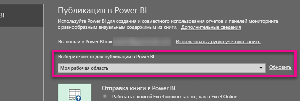
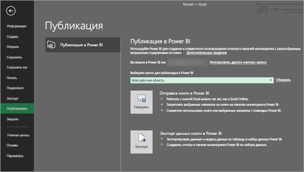
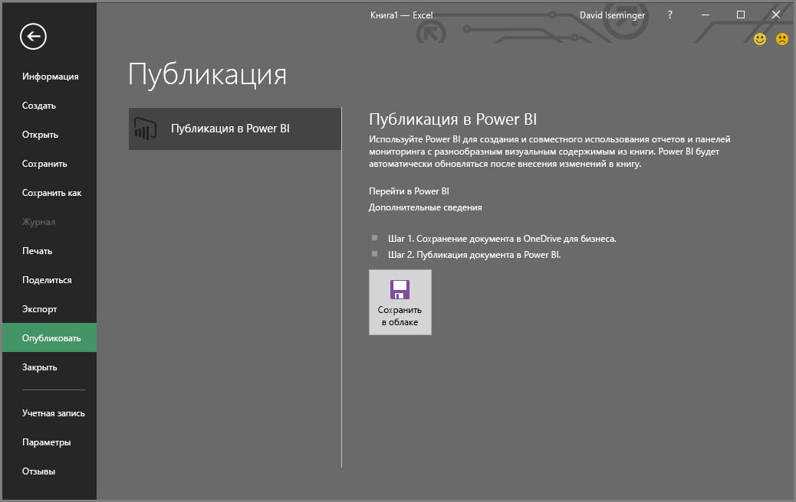
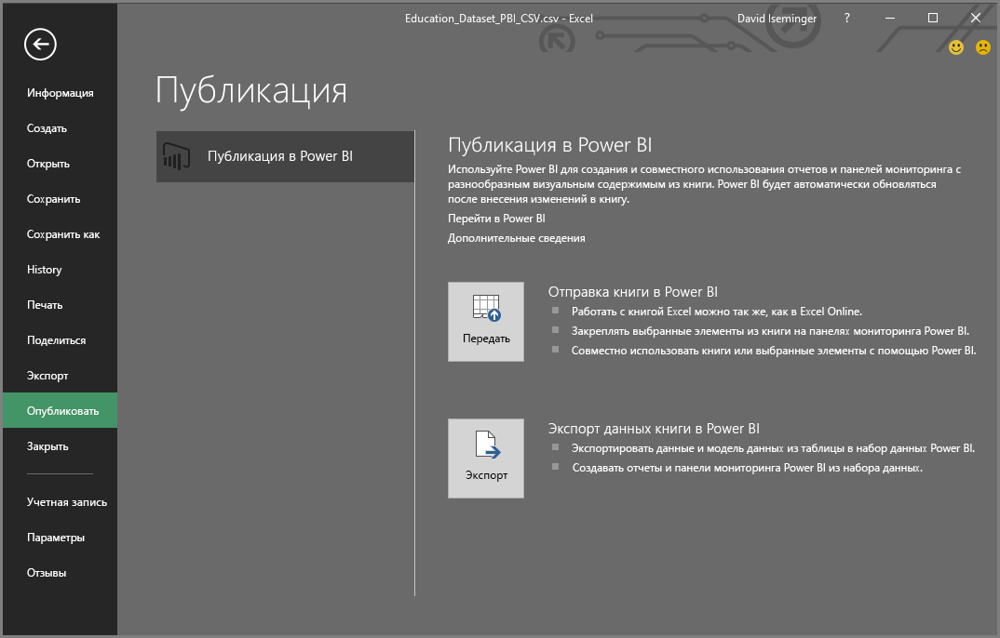

# Публикация в Power BI из Excel 2016
Excel 2016 позволяет публиковать книги Excel непосредственно на сайт [Power BI](https://powerbi.microsoft.com), где вы можете создавать предельно наглядные отчеты и информационные панелей на основе данных книги. Затем вы можете предоставить свои данные для общего доступа другим сотрудникам организации.

Прежде чем продолжить, остановимся на нескольким моментах, которые следует учитывать.

* Перед публикацией в Power BI необходимо сохранить книгу в OneDrive для бизнеса.
* Для входа в Office, OneDrive для бизнеса и Power BI должна использоваться одна и та же учетная запись.
* Нельзя опубликовать пустую книгу или книгу без какого-либо содержимого, поддерживаемого Power BI.
* Нельзя опубликовать зашифрованные или защищенные паролем книги, а также книги, защищенные с помощью управления защитой информации.
* Для публикация в Power BI требуется включить современную проверку подлинности (по умолчанию). Если эта функция отключена, параметр "Опубликовать" в меню "Файл" недоступен.

## Чтобы опубликовать книгу Excel
В Excel выберите **Файл** > **Опубликовать**.

### Публикация локальных файлов
Начиная с обновления за февраль 2017 г., в Excel 2016 поддерживается публикация локальных файлов. Их не нужно сохранять в OneDrive для бизнеса или SharePoint Online.

> [!IMPORTANT]
> Только в Excel 2016 с подпиской Office 365 реализована возможность публикации локальных файлов. В автономной версии Excel 2016 по-прежнему будет доступна только функция "Опубликовать", которая требует сохранения книги Excel в OneDrive для бизнеса или SharePoint Online.
> 
> 

При выборе параметра **Опубликовать** вы сможете выбрать рабочую область, в которую необходимо опубликовать данные. Это может быть доступная личная или групповая рабочая область.

Вам будут доступны два способа передачи книги в Power BI.

После публикации она хранится в виде копии в Power BI отдельно от локального файла. Если вы хотите обновить файл в Power BI, обновленную версию необходимо опубликовать еще раз. Вы можете обновить данные и задать запланированное обновление в книге или наборе данных Power BI.

### Публикация из автономной версии Excel
Если книга еще не сохранена в OneDrive, необходимо сначала сохранить ее там. Щелкните Save to Cloud (Сохранить в облаке) и выберите расположение в OneDrive для бизнеса.

После сохранения книги в OneDrive при нажатии кнопки **Опубликовать** вам будут доступны два способа передачи книги в Power BI.

#### Передача книги в Power BI
Если выбрать этот способ, ваша книга отобразится в Power BI так же, как в Excel Online. При этом у вас будет несколько удобных функций, не доступных в Excel Online, которые помогут вам закрепить элементы из листов на информационных панелях.

Книгу нельзя редактировать, когда она открыта в Power BI, но если необходимо внести какие-либо изменения, выберите **Изменить** и отредактируйте книгу в Excel Online или откройте ее в Excel на своем компьютере. Любые внесенные изменения сохраняются в книге в OneDrive.

Когда выполняется передача, в Power BI набор данных не создается. Книга будет отображаться на панели навигации по рабочей области в разделе "Отчеты". Книги, переданные в Power BI, обозначаются специальным значком Excel, который идентифицирует их как переданные книги Excel.

Выберите этот параметр, только если хотите отображать в Power BI какие-либо данные с листов, сводные таблицы или диаграммы.
Использование команды "Отправить" из функции "Публикация в Power BI" в Excel фактически равносильно использованию в Power BI в браузере команды "Получить данные > Файл > OneDrive для бизнеса > Подключиться к данным Excel, а также управлять ими и просматривать их в Power BI".

#### Экспорт данных книги в Power BI
Если выбрать этот параметр, все поддерживаемые данные в таблицах и (или) в модели данных будут экспортированы в новый набор данных в Power BI. Если у вас есть листы Power View, они будут созданы повторно в Power BI как отчеты.

Вы можете продолжить редактирование в книге. При сохранении изменений они будут синхронизированы с набором данных в Power BI, обычно в течение часа. Если вам требуется более быстрый результат, можно просто повторно щелкнуть "Опубликовать", и ваши изменения сразу экспортируются. При этом также будут обновлены все визуализации в отчетах и на информационных панелях.

Выберите этот параметр, если для загрузки данных в модель данных вы использовали функцию "Скачать и преобразовать" или Power Pivot, или если ваша книга содержит листы Power View с визуализациями, которые необходимо отображать в Power BI.

Использование команды "Экспорт" из функции "Публикация в Power BI" в Excel фактически равносильно использованию в Power BI в браузере команды "Получить данные > Файл > OneDrive для бизнеса > Export Excel data into Power BI" (Экспорт данных Excel в Power BI).

## Публикация
При выборе любого из этих параметров Excel выполнит вход в Power BI, используя вашу текущую учетную запись, а затем опубликует книгу на сайт Power BI. Обратите внимание на строку состояния в Excel. В ней показывается ход выполнения процесса.

По завершении вы можете перейти в Power BI прямо из Excel.

## Дальнейшие действия
[Данные Excel в Power BI](service-excel-workbook-files.md)  
Появились дополнительные вопросы? [Ответы на них см. в сообществе Power BI.](http://community.powerbi.com/)

