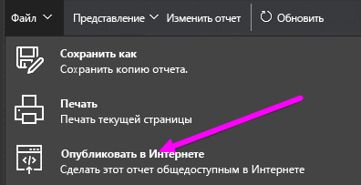
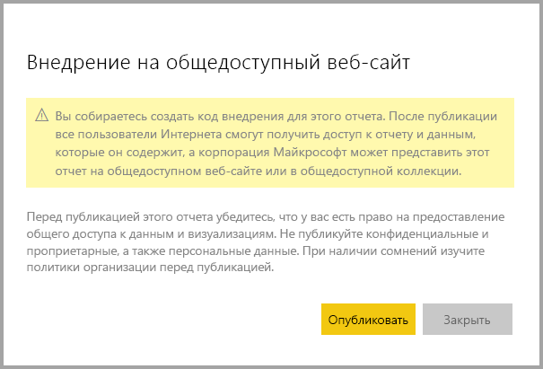
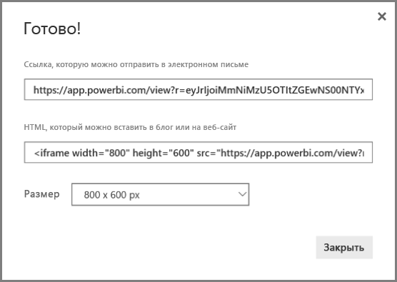
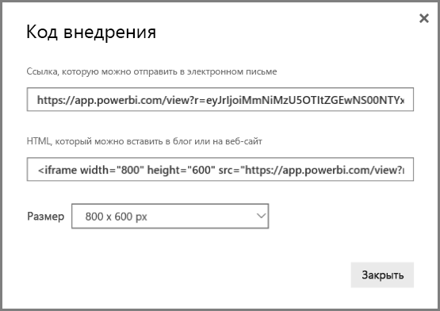
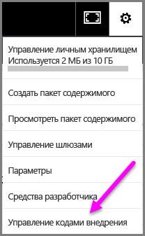
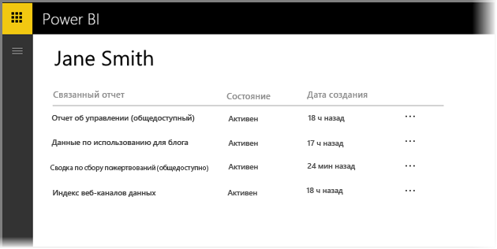
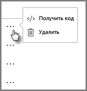

# Публикация в Интернете из Power BI

С помощью функции Power BI **Опубликовать в Интернете** вы можете с любого устройства легко встраивать интерактивные визуализации Power BI в интернет-ресурсы, например в публикации блогов, на веб-сайты, в электронные письма или социальные сети.

Опубликованные визуальные элементы можно без труда изменять, обновлять или выводить из общего доступа.

> [!WARNING]
> При использовании функции **Опубликовать в Интернете** просмотреть публикуемый отчет или визуальный элемент может любой пользователь, имеющий подключение к Интернету. При просмотре этих отчетов проверка подлинности не выполняется. Функцию публикации в Интернете следует использовать только с отчетами или данными, доступными для просмотра любому интернет-пользователю (пользователю общедоступной сети без проверки подлинности). Это включает в себя подробные данные уровня, агрегированные в отчетах. Перед публикацией отчета убедитесь, что у вас есть право предоставлять общий доступ к данным и визуализациям. Не публикуйте конфиденциальную или частную информацию. Если вы не уверены в своих правах, изучите политики своей организации, прежде чем приступать к публикации.

>[!Note]
>Чтобы безопасно внедрить содержимое во внутренний портал или сайт, используйте параметры [Внедрить](service-embed-secure.md) или [Внедрить в SharePoint Online](service-embed-report-spo.md). Это обеспечит правильное применение всех разрешений и политик защиты данных при обращении пользователей к внутренним данным.

## Использование функции публикации в Интернете

Функция **Опубликовать в Интернете** доступна в отчетах в личных и групповых рабочих областях, для которых у вас есть разрешение на редактирование.  Ее нельзя использовать в отчетах, к которым вам был предоставлен доступ, а также в отчетах, в которых для защиты данных используются функции безопасности на уровне строк. Полный список ситуаций, в которых не поддерживается функция публикации в Интернете, см. в разделе **Ограничения** ниже. Прежде чем использовать функцию публикации в Интернете, ознакомьтесь со сведениями в подразделе **Предупреждение**, приведенными выше.

Демонстрацию этой функции см. в следующем *коротком видеоролике*. Затем выполните следующие действия, чтобы поработать с ней самостоятельно.

<iframe width="560" height="315" src="https://www.youtube.com/embed/UF9QtqE7s4Y" frameborder="0" allowfullscreen></iframe>

Далее описано использование функции **Опубликовать в Интернете**.

1. В отчете в доступной для редактирования рабочей области выберите **Файл > Опубликовать в Интернете**.

   

2. Просмотрите содержимое диалогового окна и выберите **Создать код внедрения** , как показано в следующем окне.

   

3. Ознакомьтесь с предупреждением, приведенном в следующем диалоговом окне, и подтвердите, что данные можно внедрить в общедоступный веб-сайт. Нажмите кнопку **Опубликовать**.

   

4. Откроется диалоговое окно, содержащее ссылку, которую можно отправить в электронном письме, внедрить в код (например, iFrame) или вставить непосредственно на веб-страницу или в блог.

   

5. Если ранее был создан код внедрения для отчета, он сразу же появится. Для каждого отчета можно создать только один код внедрения.

   

## Советы и рекомендации по режимам просмотра

Содержимое, внедряемое в публикацию блога, обычно требуется разместить в соответствии с конкретным размером экрана.  Можно также настроить высоту и ширину в теге iFrame. Однако также может потребоваться, чтобы отчет размещался в рамках заданной области iFrame, поэтому при редактировании отчета необходимо задать нужный режим просмотра.

В следующей таблице содержатся рекомендации по режимам просмотра и их отображению после внедрения.

| Режим просмотра | Вид после внедрения |
| --- | --- |
|  |**Вписать в страницу** — в этом случае будет учитываться высота и ширина страницы отчета. Если для вашей страницы установлены динамические пропорции (например, 16:9 или 4:3), содержимое будет масштабироваться с учетом размеров области iFrame. Когда содержимое размещено в кадре iFrame, использование функции **Вписать в страницу** может привести к **появлению пустых областей с серым фоном** в отдельных частях рамки iFrame после масштабирования содержимого. Чтобы избежать этого, задайте для области iFrame правильные параметры высоты и ширины. |
|  |**Фактический размер** — в этом случает отчет сохраняет свой размер, заданный на странице отчета. Это может привести к появлению в iFrame полос прокрутки. Чтобы избавиться от полос, задайте для области iFrame значения высоты и ширины. |
|  |**По ширине** — в этом случае содержимое размещается в горизонтальной области iFrame. Рамка по-прежнему отображается, но содержимое будет масштабироваться в соответствии со всем доступным горизонтальным пространством. |

## Советы и приемы для выбора оптимальной высоты и ширины iFrame

Код внедрения, полученный после публикации в Интернете, будет выглядеть следующим образом.

Ширину и высоту кода можно изменить вручную, чтобы он размещался на странице именно так, как требуется.

Чтобы содержимое лучше вписывалось в кадр, попробуйте добавить 56 пикселей к высоте iFrame. Это позволит учесть текущий размер нижней строки. Если для страницы вашего отчета задан динамический размер, воспользуйтесь таблицей ниже, чтобы выбрать размеры, позволяющие не допустить появления пустых участков.

| Соотношение | Размер | Ширина x высота |
| --- | --- | --- |
| 16:9 |Маленький |640 x 416 пикселей |
| 16:9 |Средний |800 x 506 пикселей |
| 16:9 |Большой |960 x 596 пикселей |
| 4:3 |Маленький |640 x 536 пикселей |
| 4:3 |Средний |800 x 656 пикселей |
| 4:3 |Большой |960 x 776 пикселей |

## Управление кодами внедрения

После создания кода внедрения функцией **Опубликовать в Интернете** вы можете управлять создаваемыми кодами в меню **Параметры** службы Power BI. Управление кодами внедрения позволяет удалять конечный визуальный элемент или отчет для кода (отображение кода внедрения является нецелесообразным) или повторно получать код внедрения.

1. Чтобы управлять кодами внедрения для **публикации в Интернете** , откройте окно **Настройки** с шестеренкой и выберите пункт **Управление кодами внедрения**.

   

2. Появится список созданных вами кодов внедрения, как показано на следующем рисунке.

   

3. Для каждого кода внедрения функции **Опубликовать в Интернете** в списке можно выполнить операцию получения кода или удаления кода (в этом случае ссылки на этот отчет или визуальный элемент перестают работать).

   

4. Если выбрать вариант **Удалить**, вам будет предложено подтвердить удаление кода внедрения.

   

## Обновления отчетов и данных

После создания кода внедрения для функции **Опубликовать в Интернете** и предоставления к нему общего доступа отчет обновляется с помощью любых вносимых вами изменений. Однако важно знать, что пользователи смогут увидеть обновленную версию не сразу, а через некоторое время. Обновление отчета или визуального элемента занимает примерно час, прежде чем оно появится в кодах внедрения функции "Опубликовать в Интернете".

Когда вы первоначально используете функцию **Опубликовать в Интернете** для получения кода внедрения, немедленно активируется ссылка на код внедрения, поэтому код может просмотреть каждый, кто открывает ссылку.  После первого использования функции публикации в Интернете все последующие обновления отчетов или визуальных элементов, на которые указывает ссылка функции "Опубликовать в Интернете", будут доступны пользователям примерно через час.

Дополнительные сведения см. в разделе **Принцип действия** далее в этой статье. Если вы хотите, чтобы ваши изменения были доступны сразу, удалите код внедрения и создайте новый.

## Обновление данных

Обновления данных автоматически отражаются во внедренном отчете или визуальном элементе. Обновленные данные начинают отображаться из кода внедрения приблизительно через час. Чтобы отключить автоматическое обновление, выберите **Не обновлять** в расписании для набора данных, используемого в отчете.  

## Настраиваемые визуальные элементы

Функция **Опубликовать в Интернете**поддерживает настраиваемые визуальные элементы. Когда вы используете публикацию в Интернете, пользователям, которым вы предоставляете общий доступ к опубликованному визуальному элементу, не нужно включать настраиваемые визуальные элементы для просмотра отчета.

## Ограничения

Функция **Опубликовать в Интернете** поддерживается большинством источников данных и отчетов в службе Power BI. Но следующие компоненты **сейчас не поддерживаются или недоступны** для использования с этой функцией.

- Отчеты, использующие функции безопасности на уровне строк.
- Отчеты, использующие любой источник данных динамического подключения, включая локальные многомерные службы Analysis Services, размещенные в табличной модели Analysis Services, и службы Azure Analysis Services.
- Отчеты, к которым вам предоставлен доступ непосредственно или через пакет содержимого организации.
- Отчеты в группе, в которой вы не являетесь участником с правами редактирования.
- В настоящее время в отчетах для функции "Опубликовать в Интернете" не поддерживаются визуальные элементы R.
- Экспорт данных из визуальных элементов в отчете, опубликованном в Интернете
- Визуальные элементы ArcGIS Maps for Power BI (предварительная версия)
- Отчеты, содержащие меры уровня отчета DAX
- Модели запросов данных единого входа
- [Конфиденциальная или частная информация](#publish-to-web-from-power-bi)
- Возможность автоматической аутентификации, предоставляемая параметром **Внедрение**, не работает с API JavaScript для Power BI. При работе с API JavaScript для Power BI следует использовать подход к внедрению, основанный на концепции [данные принадлежат пользователю](developer/embed-sample-for-your-organization.md). Дополнительные сведения о шаблоне [данные принадлежат пользователю](developer/embed-sample-for-your-organization.md).

## Настройка клиента

Администраторы Power BI могут включать или отключать функцию публикации в Интернете. Они также могут предоставить доступ только определенным группам. Возможность создания кода внедрения может измениться в зависимости от этой настройки.

|Избранное |Включена для всей организации |Отключена для всей организации |Конкретные группы безопасности   |
|---------|---------|---------|---------|
|**Опубликовать в Интернете** в меню **Файл** отчета.|Включена для всех|Не отображается никому|Отображается только авторизованным пользователям и группам.|
|**Управление кодами внедрения** в меню **Параметры**|Включена для всех|Включена для всех|Включена для всех  Параметр * **Удалить** доступен для авторизованных пользователей или групп. Параметр * **Получить коды** доступен для всех.|
|Параметр **Коды внедрения** на портале администратора|Состояние может иметь одно из значений: * Активен * Не поддерживается * Заблокирован|Отображается состояние **Отключен**|Состояние может иметь одно из значений: * Активен * Не поддерживается * Заблокирован  Если пользователь не авторизовался в соответствии с настройками клиента, будет отображаться состояние **Нарушено**.|
|Существующие опубликованные отчеты|Все включены|Все отключены|Отчеты продолжают отображаться для всех.|

## Основные сведения о столбце состояния кода внедрения

При просмотре страницы **Управление кодами внедрения** для кодов внедрения функции **Опубликовать в Интернете** предоставляется столбец состояния. Коды внедрения по умолчанию активны, однако вы можете столкнуться с состояниями, перечисленными в таблице ниже.

| Состояние | Описание |
| --- | --- |
| **Активен** |Пользователи Интернета могут просматривать отчет и работать с ним. |
| **Заблокирован** |Содержимое отчета не соответствует [условиям предоставления услуг для Power BI](https://powerbi.microsoft.com/terms-of-service). Он был заблокирован корпорацией Майкрософт. Если вы считаете, что это произошло по ошибке, обратитесь в службу поддержки. |
| **Не поддерживается** |Для данных в отчете используются функции безопасности на уровне строк либо другая неподдерживаемая конфигурация. Полный список см. в разделе **Ограничения**. |
| **Нарушено** |Код внедрения не поддерживается определенной политикой клиента. Как правило, так происходит, когда создан код внедрения, а затем изменен параметр клиента "Опубликовать в Интернете", чтобы исключить пользователя, которому принадлежит этот код. Если параметр клиента отключен или пользователю запрещено создавать коды внедрения, для существующих кодов будет отображаться состояние **Нарушено**. |

## Как сообщить о проблеме с содержимым, опубликованным в Интернете

Чтобы сообщить о проблеме, связанной с содержимым, **публикуемым в Интернете** , которое внедрено в веб-сайт или блог, используйте значок **флажка** в нижней панели, как показано на следующем рисунке. Вам будет предложено отправить в корпорацию Майкрософт сообщение с описанием проблемы. Специалисты Майкрософт оценят содержимое на соответствие условиям предоставления услуг для Power BI и примут соответствующие меры.

Чтобы сообщить о проблеме, выберите значок **флажка** в нижней строке отчета, который опубликован в Интернете.

## Лицензирование и цены

Чтобы использовать функцию **Опубликовать в Интернете**, необходимо быть пользователем Microsoft Power BI. Пользователи отчета (с правами на чтение и просмотр) не обязаны быть пользователями Power BI.

## Принцип действия (технические подробности)

При создании кода внедрения с помощью функции **Опубликовать в Интернете**отчет становится виден пользователям в Интернете. Он находится в открытом доступе, и пользователи, которые его просматривают, могут легко делиться им с помощью различных каналов связи. Когда пользователи просматривают отчет, используя прямой общедоступный URL-адрес, или видят его встроенным в веб-страницу или блог, Power BI кэширует определения отчета и результаты запросов, необходимых для просмотра отчета. Такой подход гарантирует, что отчет могут просматривать тысячи пользователей одновременно без какого-либо влияния на производительность.

Кэш сохраняется в течение длительного времени, поэтому при обновлении определения отчета (например, при изменении режима просмотра) или обновлении данных отчета изменения будут отражены в версии отчета, просматриваемой пользователями, приблизительно через час. Поэтому рекомендуется заранее планировать и организовывать свою работу и создавать код внедрения функцией **Опубликовать в Интернете** только в том случае, если вас устраивают все параметры.

## Дальнейшие действия

- [Внедрение с помощью веб-части отчетов в SharePoint Online](service-embed-report-spo.md) 

- [Embed a report in a secure portal or website](service-embed-secure.md) (Внедрение отчета на защищенный портал или сайт)

Появились дополнительные вопросы? [Ответы на них см. в сообществе Power BI.](http://community.powerbi.com/)
