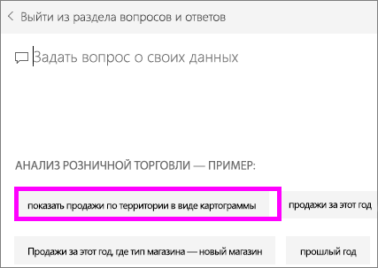

# Создание избранных вопросов для функции вопросов и ответов Power BI
Если у вас есть набор данных, вы можете добавить для него собственные избранные вопросы.  Функция "Вопросы и ответы" в Power BI покажет эти вопросы вашим коллегам, (*использующим*) набор данных.  Избранные вопросы дают вашим коллегам представление о типах вопросов, которые можно задавать о наборе данных. Вы сами определяете избранные вопросы — добавьте популярные вопросы, вопросы, дающие интересный результат, или вопросы, которые трудно выразить.

Посмотрите, как Уилл добавляет избранные вопросы в функцию вопросов и ответов Power BI и использует их для работы с набором данных. Затем сделайте то же самое, выполнив пошаговые инструкции, приведенные под видео.

<iframe width="560" height="315" src="https://www.youtube.com/embed/E1mIAyEXuF4" frameborder="0" allowfullscreen></iframe>

> [!NOTE]
> Избранные вопросы функции "Вопросы и ответы" также доступны в [приложении Microsoft Power BI для iOS на устройствах iPad, iPhone и iPod Touch](mobile-apps-ios-qna.md), а также в предварительной версии этой функции в Power BI Desktop. При этом создавать вопросы можно только в службе Power BI (app.powerbi.com).
> 

В статье используется пример [Анализ розничной торговли](sample-datasets.md).

1. Выберите поле "Вопросы и ответы" на панели мониторинга.   Обратите внимание, что функция вопросов и ответов уже помогает вам, отображая список терминов, которые присутствуют в наборе данных.
2. Чтобы пополнить этот список, выберите значок шестеренки в правом верхнем углу Power BI.  
   
3. Выберите **Параметры** &gt; **Наборы данных** &gt; **Анализ розничной торговли — пример** &gt; **Избранные вопросы**.  
4. Выберите **Добавить вопрос**.
   
   
5. Введите вопрос в текстовое поле и выберите **Применить**.   При необходимости добавьте другой вопрос, выбрав **Добавить вопрос**.  
   
6. Вернитесь к панели мониторинга Power BI для примера анализа розничной торговли и наведите курсор мыши на окно вопросов и ответов.   
   
7. Новый популярный вопрос **Sales by territory as a map**(Продажи по территориям в виде карты) стоит первым в списке. Выберите его.  
8. Ответ отображается в виде заполненной визуализации карты.  
   

### Дальнейшие действия
[Вопросы и ответы в Power BI](power-bi-q-and-a.md)  
[Учебник. Использование компонента "Вопросы и ответы" Power BI с примером анализа розничной торговли](power-bi-visualization-introduction-to-q-and-a.md)  
[Power BI — основные понятия](service-basic-concepts.md)  
Появились дополнительные вопросы? [Ответы на них см. в сообществе Power BI.](http://community.powerbi.com/)

