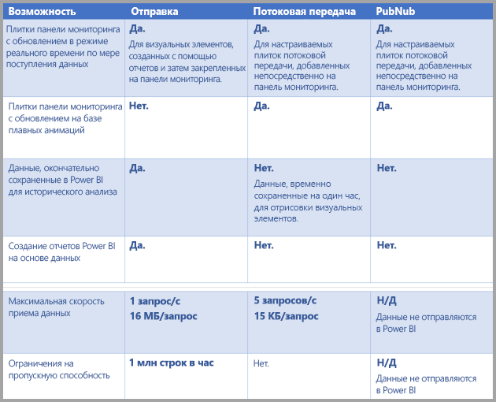
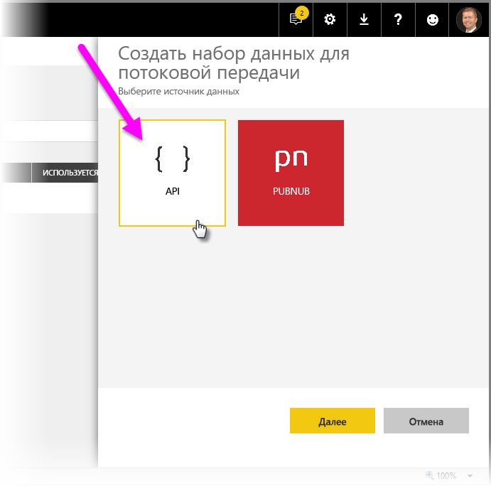
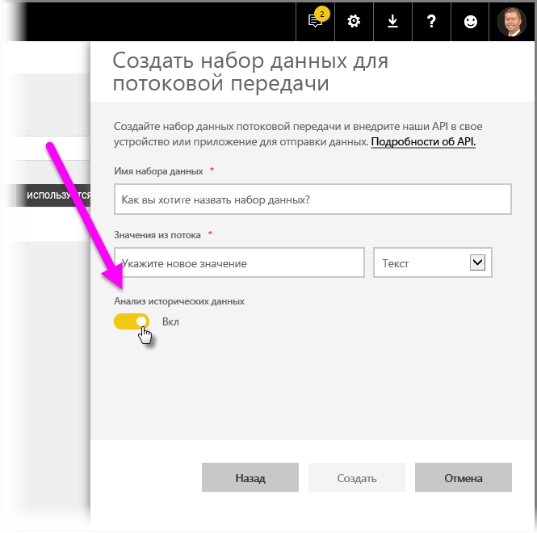
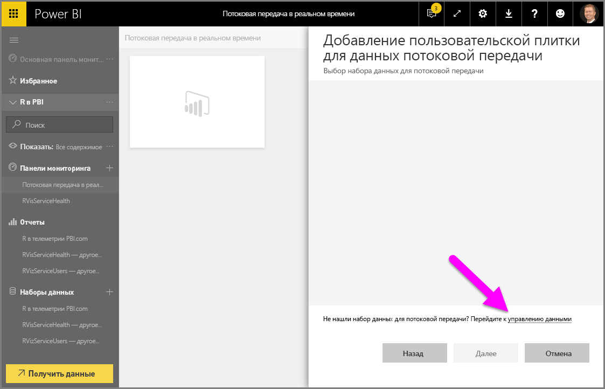
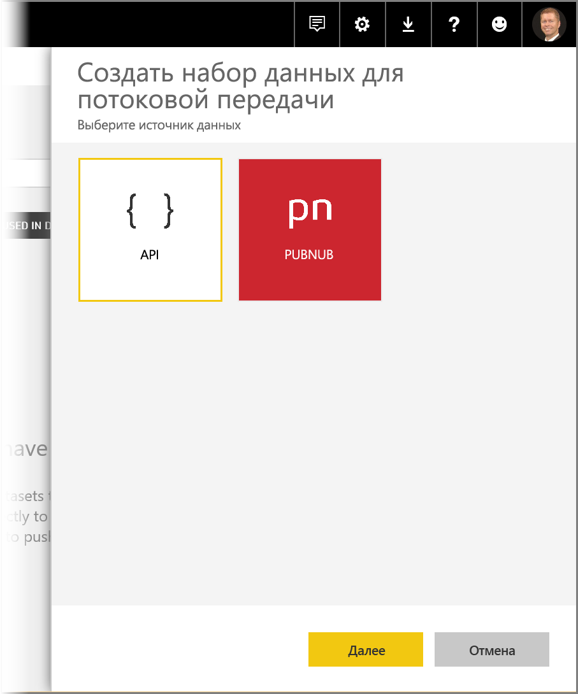
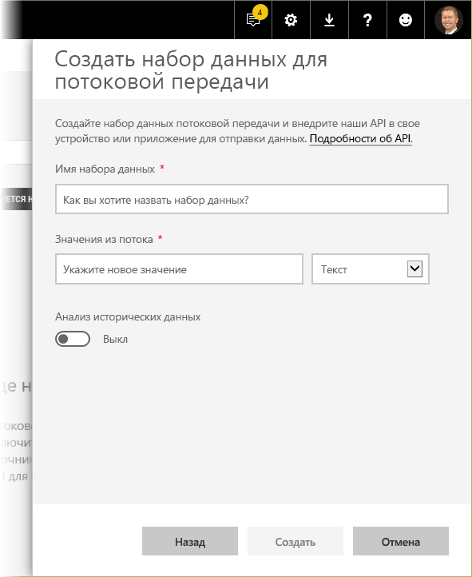
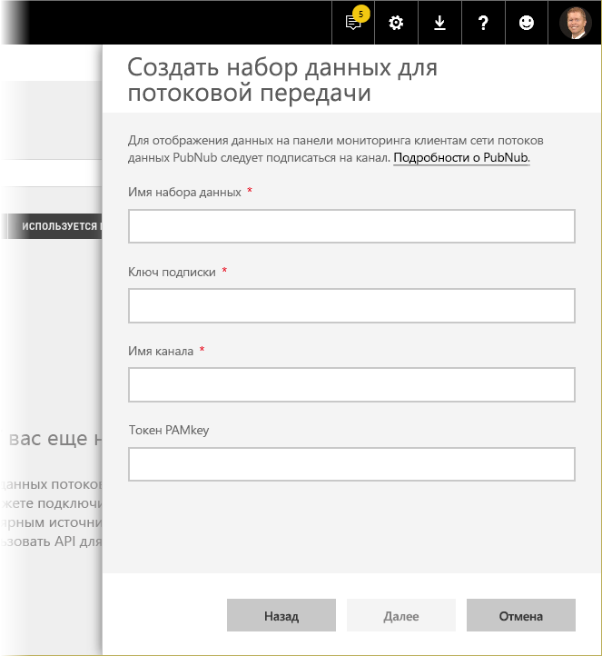
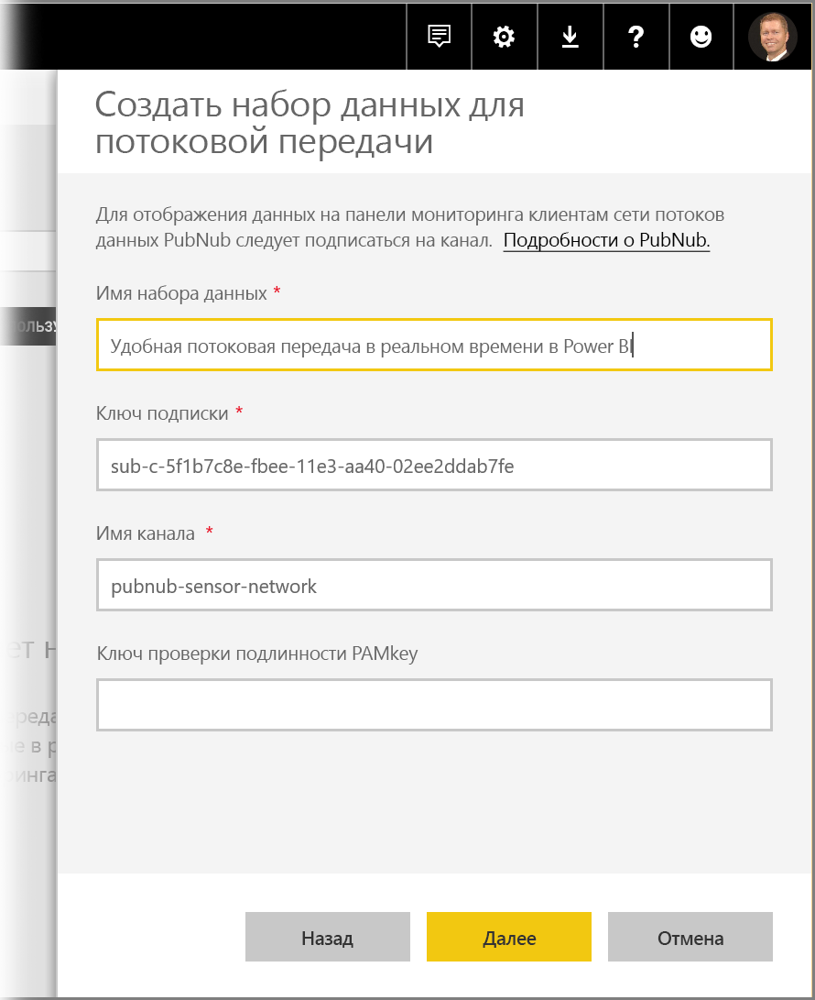
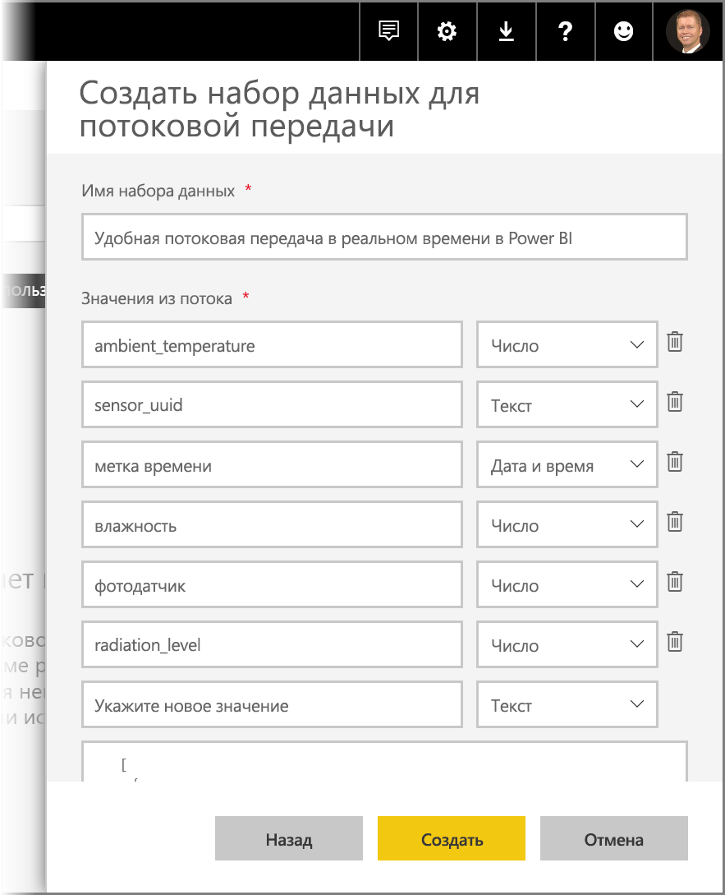

# Потоковая передача в реальном времени в Power BI
Потоковая передача в реальном времени в Power BI позволяет передавать данные и обновлять панели мониторинга в режиме реального времени. Любая визуализация или панель мониторинга, которую можно создать в Power BI, может отображать и обновлять данные в реальном времени. В качестве устройств и источников потоковых данных могут использоваться датчики фабрики, источники из социальных сетей, метрики использования службы и многое другое, откуда можно собирать или передавать зависимые от времени данные.

В этой статье показано, как настроить набор данных для потоковой передачи в Power BI в режиме реального времени. Но прежде чем мы перейдем к этому, следует ознакомиться с типами наборов данных, передаваемых в режиме реального времени и отображаемых на плитках (и панелях мониторинга), а также узнать о различиях между этими наборами данных.

## Типы наборов данных, передаваемых в режиме реального времени
Есть три типа наборов данных, передаваемых и отображаемых на панели мониторинга в режиме реального времени:

* набор данных для отправки;
* набор данных для потоковой передачи;
* набор данных PubNub.

Сначала давайте посмотрим, чем эти наборы данных отличаются (см. этот раздел), а затем обсудим, как отправлять данные в каждый такой набор.

### Набор данных для отправки
С помощью **набора данных для отправки** данные передаются в службу Power BI. Когда создается набор данных, служба Power BI автоматически создает новую базу данных для хранения данных. Так как поступающие данные продолжают храниться в основной базе данных, на основе этих данных можно создавать отчеты. Эти отчеты и связанные визуальные элементы аналогичны любым другим визуальным элементам, связанным с отчетами. А это значит, что вы можете использовать все возможности, доступные в Power BI для работы с отчетами, чтобы создавать визуальные элементы, включая пользовательские визуальные элементы, предупреждения об изменении данных, закрепленные на панели мониторинга плитки и многое другое.

Создав отчет с помощью набора данных для отправки, вы можете закрепить на панели мониторинга любой из связанных визуальных элементов. На этой панели мониторинга визуальные элементы будут обновляться в режиме реального времени в соответствии с обновлением данных. Когда служба запущена, для плитки на панели мониторинга обновление активируется при каждом получении новых данных.

С закрепленными плитками на основе набора данных для отправки связаны два момента.

* Если вы закрепите с помощью параметра *Закрепление живой плитки* весь отчет, данные автоматически обновляться **не** будут.
* Закрепив визуальный элемент на панели мониторинга, вы можете воспользоваться функцией **Вопросы и ответы**, чтобы задать вопросы о наборе данных для отправки на естественном языке. Используя обработчик семантических запросов **Вопросы и ответы** для создания соответствующего запроса, вы можете закрепить итоговый визуальный элемент на панели мониторинга. Эта панель мониторинга *также* будет обновляться в режиме реального времени.

### Набор данных для потоковой передачи
С помощью **набора данных для потоковой передачи** данные также отправляются в службу Power BI. Но есть одно важное отличие: в Power BI данные сохраняются только во временный кэш, срок действия которого быстро истекает. Временный кэш используется только для отображения визуальных элементов, которые носят временный характер (например, используются для отображения событий на графике с временным окном в один час).

Для **набора данных для потоковой передачи** основная база данных *не* используется, поэтому вы *не можете* создавать визуальные элементы отчетов на основе данных, передаваемых из потока. Таким образом, вы не можете пользоваться возможностями, доступными при работе отчетов, включая фильтрацию, пользовательские визуальные элементы и другие связанные функции.

Единственный способ визуализации набора данных для потоковой передачи — это добавить плитку и использовать набор данных для потоковой передачи как источник **данных для пользовательской потоковой передачи**. Плитки для отображения данных пользовательской потоковой передачи (на основе **набора данных для потоковой передачи**) оптимизированы для быстрого отображения данных в режиме реального времени. Следовательно, задержка между отправкой данных в службу Power BI и обновлением визуального элемента очень незначительна, так как данные не записываются в базу данных и не считываются из нее.

На практике наборы данных для потоковой передачи и связанные визуальные элементы лучше всего использовать в ситуациях, когда очень важно минимизировать задержку между передачей данных и их визуализацией. Кроме того, данные рекомендуется отправлять в формате, который можно визуализировать как есть — то есть без дополнительной агрегации. Примеры данных, визуализируемых как есть, включают показатели температуры и предварительно вычисляемых средних значений.

### Набор данных PubNub
Если вы работаете с набором данных **PubNub** для потоковой передачи, веб-клиент Power BI использует пакет SDK для PubNub, чтобы считывать существующий поток данных PubNub, при этом данные не сохраняются службой Power BI.

Как и с**набором данных для потоковой передачи**, для**набора данных PubNub для потоковой передачи** база данных в Power BI не предусмотрена. Это значит, что вы не можете ни создавать визуальные элементы отчета на основе передаваемых данных, ни пользоваться преимуществами функций отчетов, включая фильтрацию, пользовательские визуальные элементы и т. д. Следовательно, **набор данных PubNub для потоковой передачи** можно визуализировать, только добавив плитку на панель мониторинга и настроив поток данных PubNub в качестве источника.

Плитки на основе **набора данных PubNub для потоковой передачи** оптимизированы для быстрого отображения данных в режиме реального времени. Так как Power BI непосредственно подключается к потоку данных PubNub, задержка между отправкой данных в службу Power BI и обновлением визуального элемента очень незначительна.

### Матрица набора данных для потоковой передачи
В следующей таблице (или матрицы, если угодно) описаны три типа наборов данных для потоковой передачи в режиме реального времени, а также перечислены возможности и ограничения каждого из них.

> [!NOTE]
> В [этой статье MSDN](https://msdn.microsoft.com/library/dn950053.aspx) приведены сведения об ограничениях на объем **отправляемых** данных.
> 
> 

## Отправка данных в наборы данных
В предыдущем разделе мы описали три основных типа наборов данных, которые можно использовать для потоковой передачи в режиме реального времени, а также объяснили разницу между ними. В этом разделе описывается, как создавать и отправлять данные в эти наборы данных.

Есть три основных способа отправки данных в набор данных:

* с помощью интерфейсов REST API для Power BI;
* с помощью пользовательского интерфейса потоковой передачи набора данных;
* с помощью Azure Stream Analytics.

Давайте рассмотрим каждый из этих способов по очереди.

### Использование интерфейсов API REST Power BI для отправки данных
С помощью **интерфейсов API REST Power BI** можно создавать и отправлять данные в наборы данных для **отправки** и **потоковой передачи**. Когда вы создаете набор данных с помощью REST API Power BI, флаг *defaultMode* определяет тип набора данных (для отправки или потоковой передачи). Если флаг *defaultMode* не указан, по умолчанию используется набор данных для **отправки**.

Значение *pushStreaming* для флага *defaultMode* определяет набор данных одновременно как для **отправки**, так *и* для **потоковой передачи**, позволяя использовать преимущества двух этих типов. См. дополнительные сведения о [**создании набора данных для потоковой передачи**](https://msdn.microsoft.com/library/mt203562.aspx) с помощью интерфейса REST API и использовании флага *defaultMode*.

> [!NOTE]
> Вы можете использовать наборы данных со значением *pushStreaming*, установленным для флага *defaultMode*. В таком случае, если запрос превышает ограничение на размер набора данных для **потоковой передачи** в 15 КБ, но не превышает ограничение на размер набора данных для **отправки** в 16 МБ, запрос будет выполнен успешно, а данные будут обновляться в наборе для отправки. При этом отображение потоковых данных на всех плитках временно завершится ошибкой.
> 
> 

Когда набор данных будет создан, вы можете использовать интерфейсы REST API для отправки данных с помощью [API **добавления строк**](https://msdn.microsoft.com/library/mt203561.aspx), как [показано в этой статье](https://msdn.microsoft.com/library/mt203561.aspx).

Безопасность всех запросов к REST API обеспечивается с помощью **Azure AD OAuth**.

### Использование пользовательского интерфейса потоковой передачи набора данных для отправки данных
В службе Power BI можно создать набор данных с помощью **API**, как показано на следующем рисунке.

Создавая набор данных для потоковой передачи, вы можете включить **анализ исторических данных** (см. ниже); эта функция играет важную роль.

Когда **анализ исторических данных** отключен (а он отключен по умолчанию), будет создан **набор данных для потоковой передачи**, как описано выше в этой статье. Когда **анализ исторических данных** *включен*, это определяет создаваемый набор данных как для **потоковой передачи**, так и для **отправки**. Это эквивалентно использованию интерфейсов REST API Power BI для создания набора данных с помощью флага *defaultMode* и значения *pushStreaming*, как описано выше в этой статье.

> [!NOTE]
> При использовании наборов для потоковой передачи, созданных с помощью пользовательского интерфейса службы Power BI, как описано в предыдущем абзаце, выполнять проверку подлинности Azure AD не требуется. Владелец таких наборов данных получает URL-адрес с элементом rowkey, что позволяет авторизовать запрашивающую сторону при отправке данных в набор данных без использования токена носителя Azure AD OAuth. При этом вы все равно можете использовать Azure AD (AAD) для отправки данных в набор данных.
> 
> 

### Использование Azure Stream Analytics для отправки данных
Вы можете добавить Power BI как выходные данные для **Azure Stream Analytics** (ASA), чтобы затем визуализировать эти потоки данных в службе Power BI в режиме реального времени. В этом разделе приводятся сведения о технической стороне этого процесса.

В Azure Stream Analytics используются интерфейсы REST API Power BI для создания выходного потока данных в Power BI. При этом для флага *defaultMode* устанавливается значение *pushStreaming* (см. предыдущие разделы этой статьи, посвященные использованию флага *defaultMode*). В результате вы получаете набор данных, который одновременно обладает свойствами набора данных для **отправки** и **потоковой передачи**. Когда вы создаете набор данных, Azure Stream Analytics также задает для флага **retentionPolicy* значение *basicFIFO*. Этот параметр определяет число строк, хранимых в базе данных, которая используется с набором данных для отправки, — 200 000. При достижении этого предела строки удаляются по методу FIFO (в порядке поступления).

> [!CAUTION]
> Если ваш запрос к Azure Stream Analytics приведет к быстрому созданию выходных данных в Power BI (например, один или два набора данных в секунду), Azure Stream Analytics выполнит пакетную обработку таких данных в одном запросе. Это может привести к превышению лимита на размер запроса для плитки с отображением потоковых данных. В таком случае, как упоминалось в предыдущих разделах, данные на плитках для потоковой передачи отображаться не будут. В таких случаях рекомендуется снизить скорость для выходных данных в Power BI, указав вместо максимального значения (ежесекундно), например, более 10 секунд.
> 
> 

## Настройка в Power BI набора данных, которые будут передаваться в реальном времени
Мы рассмотрели три основных типа наборов данных для потоковой передачи в режиме реального времени и три основных способа отправки данных в набор. Теперь давайте выполним в Power BI потоковую передачу набора данных в режиме реального времени.

В первую очередь необходимо выбрать один из двух вариантов использования передаваемых потоком данных в Power BI:

* **плитки** — плитки с визуализацией передаваемых данных;
* **наборы данных** — наборы, создаваемые из передаваемых данных, которые хранятся в Power BI.

В обоих случаях нужно настроить **потоковую передачу данных** в Power BI. Для этого на панели мониторинга (можно использовать существующую или создать новую) последовательно выберите **Добавить плитку** и **Пользовательские данные потоковой передачи**.

Если потоковая передача еще не настроена, щелкните ссылку на **управление данными**.

На этой странице в текстовом поле укажите конечную точку созданного набора данных для потоковой передачи. Если набор данных еще не создан, в правом верхнем углу щелкните значок "плюс" (**+**). Отобразятся доступные варианты создания набора данных для потоковой передачи.

Щелкнув значок **+**, вы увидите два варианта:

Каждый из вариантов описан в следующем разделе, где также приведены дополнительные сведения о создании **плиток** с потоковыми данными и **наборов данных** из источника потоковых данных. Плитку и набор данных затем можно использоваться для создания отчетов.

## Создание набора данных для потоковой передачи
Веб-канал данных для потоковой передачи в реальном времени, который в последствии будет использоваться и визуализироваться в Power BI, можно создать двумя способами:

* с помощью **REST API для Power BI** с использованием конечной точки потоковой передачи в реальном времени;
* **PubNub**

Давайте рассмотрим каждый способ по отдельности.

### Использование REST API для Power BI
Последние улучшения в **REST API для Power BI** облегчают разработчикам выполнение задач, связанных с потоковой передачей в реальном времени. Выбрав **API** в окне **Создать набор данных для потоковой передачи**, вы увидите записи, которые нужно указать, чтобы позволить службе Power BI подключаться к конечной точке.

Если вы хотите, чтобы передаваемые через этот поток данные хранились в службе Power BI, активируйте параметр *Анализ исторических данных*. Так вы сможете анализировать собранные данные и создавать по ним отчеты. Дополнительные сведения об API см. [здесь](https://msdn.microsoft.com/library/dn877544.aspx).

Когда поток данных будет создан, вы получите URL-адрес конечной точки с REST API. Вызывая этот адрес в приложении с помощью запроса *POST*, вы сможете передавать данные в созданный в Power BI **набор данных для потоковой передачи**.

При выполнении запросов *POST* необходимо убедиться, что текст запроса соответствует примеру JSON, предоставленному пользовательским интерфейсом Power BI. Например, поместите объекты JSON в массив.

### Использование PubNub
Интеграция потоковой передачи **PubNub** со службой Power BI дает возможность использовать высокоскоростные потоки данных **PubNub** в Power BI. Выбрав вариант **PubNub** и нажав кнопку **Далее**, вы увидите следующее окно:

> [!WARNING]
> Каналы PubNub могут быть защищены с помощью ключа проверки подлинности диспетчера PubNub Access Manager (PAM). Этот ключ будет использоваться совместно всеми пользователями с доступом к панели мониторинга. См. дополнительные сведения об [управлении доступом PubNub](https://www.pubnub.com/docs/web-javascript/pam-security).
> 
> 

Потоки данных из **PubNub** зачастую имеют большой объем и в исходном виде не всегда пригодны для хранения и статистического анализа. Чтобы использовать Power BI для статистического анализа данных из PubNub, вам нужно агрегировать необработанный поток PubNub и отправить его в Power BI. Один из способов сделать это — использовать службу [Azure Stream Analytics](https://azure.microsoft.com/services/stream-analytics/).

## Пример использования потоковой передачи в реальном времени в Power BI
Давайте рассмотрим краткий пример использования потоковой передачи в реальном времени в Power BI. Так вы сможете лучше понять ценность этой функции.

Для примера мы будем использовать общедоступный поток из **PubNub**. Вот что нужно сделать.

1. В **службе Power BI** выберите панель мониторинга (или создайте новую), последовательно щелкните **Добавить плитку** > **Пользовательские данные потоковой передачи**, а затем нажмите кнопку **Далее**.
   
   
2. Если у вас нет источников потоковых данных, щелкните ссылку на **управление данными** (под кнопкой **Далее**), а затем в правом верхнем углу выберите **+ Добавить набор данных потоковой передачи**. Выберите **PubNub** и нажмите кнопку **Далее**.
3. Укажите имя для набора данных, вставьте в появившемся окне приведенные ниже значения и нажмите кнопку **Далее**.
   
   *Ключ подписки:*
   
       sub-c-5f1b7c8e-fbee-11e3-aa40-02ee2ddab7fe
   *Канал:*
   
       pubnub-sensor-network
   
   
4. В следующем окне оставьте значения по умолчанию (задаются автоматически) и нажмите кнопку **Создать**.
   
   
5. В рабочей области Power BI создайте панель мониторинга и добавьте на нее плитку (процедура описана выше). На этот раз, выбрав при создании плитки пункт **Пользовательские данные потоковой передачи**, вам нужно указать набор данных для потоковой передачи. Поэкспериментируйте с ним. Добавляя в графики поля с *числовыми значениями*, а затем добавляя другие плитки, можно получить панель мониторинга, как на рисунке ниже. Данные на панели будут обновляться в реальном времени.
   
   

Поэкспериментируйте с примером набора данных. Затем создайте свои собственные наборы и передавайте данные в службу Power BI в реальном времени.

## Вопросы и ответы
Ниже приведены некоторые распространенные вопросы и ответы о потоковой передаче в Power BI в режиме реального времени.

#### Можно ли использовать фильтры с набором данных для отправки? И что насчет набора данных PubNub?
К сожалению, наборы данных для потоковой передачи не поддерживают фильтрацию. Наборы данных для отправки позволяют создавать и фильтровать отчеты, а затем закреплять отфильтрованные визуальные элементы на панели мониторинга. Но вы все равно не сможете изменить фильтр для визуального элемента, как только он появится на панели мониторинга.

При этом вы можете закреплять на панели мониторинга плитки с динамическими отчетами, что позволяет изменять фильтры. Тем не менее плитки с динамическими отчетами не будут обновляться в режиме реального времени по мере отправки данных. Для этого вам нужно вручную обновить визуальный объект, используя параметр *Обновить плитки панелей мониторинга* в меню **Дополнительно**.

При применении фильтров для принудительной отправки наборов данных с полями *DateTime* с точностью до миллисекунды операторы *равенства* не поддерживаются. При этом такие операторы, как больше (>) или меньше (<) работают должным образом.

#### Как увидеть последнее значение в наборе данных для отправки? И что насчет набора данных PubNub?
Наборы данных для потоковой передачи используются для отображения актуальных данных. Чтобы быстро просмотреть последние числовые значения, можно использовать визуальный элемент для потоковой передачи **Карта**. К сожалению, карта не поддерживает данные типа *DateTime* или *Text*.
Если используется набор данных для отправки, а в схеме предположительно присутствует метка времени, можно попытаться создать визуальный элемент с фильтрацией по последнему значению N.

#### Можно ли подключить наборы данных для отправки или потоковой передачи в Power BI Desktop?
К сожалению, сейчас это невозможно.

#### Учитывая ответ на предыдущий вопрос, как тогда выполнять моделирование с использованием наборов данных для отправки в режиме реального времени?
Моделирование не поддерживается для наборов данных для потоковой передачи, так как данные не хранятся постоянно. При использовании набора данных для отправки можно использовать интерфейсы REST API для обновлении таблиц или наборов данных, чтобы добавить меры и связи. Дополнительные сведения см. в статьях об [обновлении схемы таблицы](https://msdn.microsoft.com/library/mt203560.aspx) и [свойствах наборов данных](https://msdn.microsoft.com/library/mt742155.aspx).

#### Как очистить все значения в наборе данных для отправки? И что насчет набора данных PubNub?
При работе с набором данных для отправки удалять строки можно с помощью вызова REST API. Кроме того, можно также использовать удобное средство, представляющее оболочку интерфейсов REST API. Хотя сейчас нет возможности удалять строки из набора данных для потоковой передачи, данные все равно будут очищены автоматически через час.

#### Хотя выходные данные Azure Stream Analytics должны отображаться в Power BI, этого не происходит. Что не так?
Ниже описаны действия, с помощью которых можно устранить неполадки.

1. Перезапустите задание Azure Stream Analytics (для заданий, созданных до выпуска общедоступной версии функции потоковой передачи, может потребоваться перезагрузка).
2. Попробуйте выполнить повторную авторизацию подключения к Power BI в Azure Stream Analytics.
3. Проверьте рабочую область, которая указана в выходных данных Azure Stream Analytics. Проверьте в службе Power BI ту же рабочую область.
4. Проверьте, явно ли выводит Azure Stream Analytics выходные данные в Power BI (с помощью ключевого слова INTO).
5. Проверьте, выполняется ли потоковая передача данных в Azure Stream Analytics. Набор данных создается только при передаче данных.
6. Проверьте, есть ли в журналах Azure Stream Analytics предупреждения или ошибки.

## Дальнейшие действия
Ниже приведено несколько ссылок, которые могут оказаться полезными при работе с потоковой передачей данных в Power BI в режиме реального времени.

* [Обзор интерфейса REST API Power BI](https://msdn.microsoft.com/library/dn877544.aspx)
* [Ограничения REST API Power BI](https://msdn.microsoft.com/library/dn950053.aspx)
* [**Создание набора данных**](https://msdn.microsoft.com/library/mt203562.aspx)
* [**Добавление строк**](https://msdn.microsoft.com/library/mt203561.aspx)
* [Azure Stream Analytics](https://azure.microsoft.com/services/stream-analytics/)

