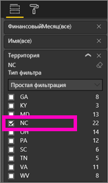

# Совместное использование отчетов Power BI с сотрудниками
Используя *Общий доступ*, вы можете предоставить нескольким пользователям доступ к информационным панелям и отчетам. Power BI предлагает [несколько способов совместной работы с информационными панелями и распространения отчетов](service-how-to-collaborate-distribute-dashboards-reports.md). Одним из них является предоставление общего доступа.

Чтобы предоставить общий доступ, вам и получателям содержимого требуется [лицензия Power BI Pro](service-free-vs-pro.md) либо же содержимое должно находиться в [емкости Premium](service-premium.md). У вас есть предложения? Для команды Power BI ваши отзывы всегда важны, поэтому перейдите на [сайт сообщества Power BI](https://community.powerbi.com/).

Вы можете совместно использовать отчет с коллегами в том же домене электронной почты, из собственной рабочей области или из рабочей области приложения. Когда вы предоставляете другим пользователям общий доступ к информационной панели мониторинга, они могут просматривать ее и взаимодействовать с ней, но не могут изменять ее. Они видят в отчетах те же данные, что и вы, если не применяется [защита на уровне строк (RLS)](service-admin-rls.md). 

## Совместное использование отчета Power BI
1. В службе Power BI [создайте информационную панель](service-dashboard-create.md) по крайней мере с одной плиткой, ссылающейся на отчет, которым вы хотите поделиться. 
   
    Даже если требуется просто предоставить общий доступ к отчету, сначала необходимо создать информационную панель, ссылающуюся на отчет, а затем предоставить общий доступ к нему. 

1. Выберите **Share** (Общий доступ) в правом верхнем углу информационной панели.

     
  
2. Предоставьте доступ указанным получателям. Если вы не хотите отправлять сообщения об информационной панели, снимите флажок с пункта **Send email notificaton to recipients** (Отправка уведомления получателям по электронной почте).

     

4. Выберите **Общий доступ**.

      Пользователи, имеющие доступ к информационной панели, имеют разрешение на просмотр базового отчета. 

1. Откройте отчет в службе Power BI, скопируйте URL-адрес страницы отчета и отправьте его своим сотрудникам. 
   
    При переходе по ссылке Power BI открывает отчет только для чтения.

## Совместное использование отфильтрованной версии отчета
Что делать, если необходимо совместно использовать отфильтрованную версию отчета? Это может быть отчет, который отображает данные только по определенному городу, продавцу или году. Для этого необходимо создать пользовательский URL-адрес.

1. Откройте отчет в [режиме редактирования](service-reading-view-and-editing-view.md), примените фильтр и сохраните отчет.
   
   В этом примере мы применяем фильтр к набору данных [Анализ розничной торговли — пример](sample-tutorial-connect-to-the-samples.md), чтобы отобразить только значения, у которых в поле **Территория** указано значение **NC**.
   
   
2. В конец URL-адреса страницы отчета добавьте следующий фрагмент:
   
   ?filter=*tablename*/*fieldname* eq *value*
   
    Поле должно иметь тип **строка**, и ни поле *Имя таблицы*, ни *Имя поля* не должны содержать пробелы.
   
   В нашем примере имя таблицы — **Store**, имя поля — **Territory**, а значение, по которому выполняется фильтрация — **NC**.
   
    ?filter=Store/Territory eq 'NC'
   
   
   
   Браузер добавляет специальные знаки, представляющие косые черты, пробелы и апострофы, поэтому окончательный адрес будет следующим:
   
   app.powerbi.com/groups/me/reports/010ae9ad-a9ab-4904-a7a1-10a61f70f2f5/ReportSection2?filter=Store%252FTerritory%20eq%20%27NC%27

3. Отправьте этот URL-адрес своим сотрудникам. 
   
   При переходе по ссылке Power BI открывает отфильтрованный отчет только для чтения.

## Дальнейшие действия
* Хотите оставить отзыв? Поделитесь своими предложениями на [веб-сайте сообщества Power BI](https://community.powerbi.com/).
* [Как предоставить общий доступ к панелям мониторинга, отчетам и плиткам?](service-how-to-collaborate-distribute-dashboards-reports.md)
* [предоставление общего доступа к панелям мониторинга](service-share-dashboards.md).
* Появились дополнительные вопросы? [Ответы на них см. в сообществе Power BI](http://community.powerbi.com/).

