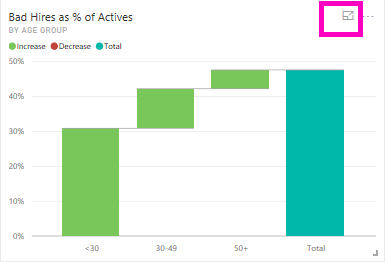
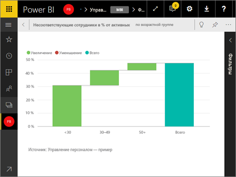
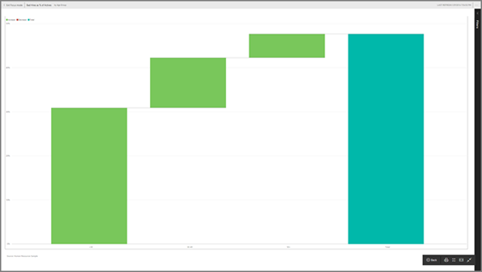

# Отображение плитки информационной панели в полноэкранном режиме
Чтобы отобразить плитку в полноэкранном режиме, ее необходимо перевести в [режим фокусировки](service-focus-mode.md).

## Что такое полноэкранный режим?
Отображайте [информационные панели, отчеты](service-fullscreen-mode.md) и плитки так, чтобы не отвлекаться на меню и кнопки навигации.  Вы всегда имеете достоверное и полное представление о своем бизнесе. Иногда это также называется ТВ-режимом.

Некоторые варианты применения полноэкранного режима:

* презентация плитки на собрании или конференции;
* отображение плитки в офисе на выделенном большом экране или проекторе;
* просмотр плитки на небольшом экране;
* просмотр плитки в режиме блокировки — вы можете коснуться экрана или наводить указатель мыши на плитки без открытия базового отчета.

## Включение и отключение полноэкранного режима
1. [Откройте плитку и отобразите ее в режиме фокусировки](service-focus-mode.md).
   
    
   
    В этом режиме плитка заполняет весь холст, что позволяет просмотреть подробные сведения. В режиме фокусировки плитки на панели мониторинга можно просматривать и изменять фильтры, примененные при создании визуального элемента.
   
    
2. В верхней строке меню выберите значок , чтобы открыть плитку в полноэкранном режиме.
3. В полноэкранном режиме плитка заполняет весь экран. Это позволяет просматривать ее содержимое, не отвлекаясь на меню и кнопки навигации.  Вы всегда имеете достоверное и полное представление о плитке. Иногда это также называется ТВ-режимом.
   
   
4. При перемещении курсора мыши отобразится меню. Это меню будет оставаться в правом нижнем углу до выхода из полноэкранного режима. Если оно исчезнет, просто переместите курсор или коснитесь экрана.
   
    
   
   * Для возврата на предыдущую страницу браузера используйте кнопку **Назад**. Если предыдущей является страница службы Power BI, она отобразится в полноэкранном режиме.  Полноэкранный режим будет сохраняться, пока вы его не закроете.
   * Чтобы распечатать плитку из полноэкранного режима, щелкните значок "Печать".
     
   * Чтобы выйти из полноэкранного режима, щелкните значок **Вернуть обычный режим** .

## Дальнейшие действия
[Панели мониторинга в Power BI](service-dashboards.md)

[Отображение информационных панелей и отчетов в полноэкранном режиме](service-fullscreen-mode.md)

[Отображение плитки панели мониторинга или визуального элемента отчета в режиме фокусировки](service-focus-mode.md)

Появились дополнительные вопросы? [Ответы на них см. в сообществе Power BI.](http://community.powerbi.com/)

