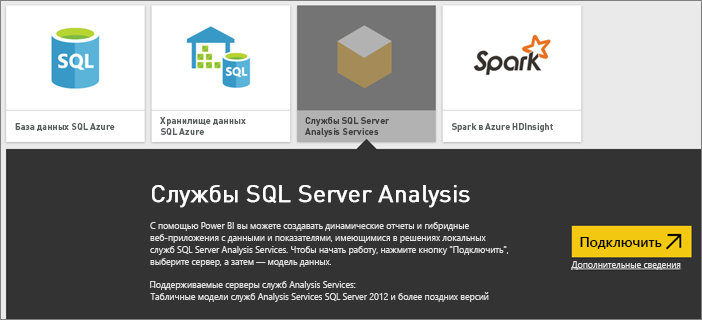

# Динамические данные служб SQL Server Analysis в Power BI
В Power BI существует два способа подключения к серверу динамических данных SQL Server Analysis Services. Вы можете подключиться к серверу SQL Server Analysis Services на вкладке **Получение данных** или подключиться к [файлу Power BI Desktop](service-desktop-files.md) или [книге Excel](service-excel-workbook-files.md), которые уже подключены к серверу служб Analysis Services. Как правило, корпорация Майкрософт настоятельно рекомендует использовать Power BI Desktop, так как это приложение располагает полным набором инструментов и возможностью хранения резервной копии файла Power BI Desktop на локальном компьютере.

 >[!IMPORTANT]
 >* Для динамического подключения к серверу Analysis Services администратор должен установить и настроить локальный шлюз данных. Дополнительную информацию см. в разделе [Локальный шлюз данных](service-gateway-onprem.md).
 >* При использовании шлюза данные размещены локально.  Отчеты, созданные на их основе, сохраняются в службе Power BI. 
 >* [Вопросы и ответы на естественном языке](service-q-and-a-direct-query.md) — предварительная версия функции для интерактивных подключений к Analysis Services.

## Подключение к модели на вкладке "Получение данных"
1. В разделе **Моя рабочая область** щелкните **Получить данные**. Можно также перейти в рабочую область группы, если она доступна.
   
   
2. Щелкните **Базы данных и другое**.
   
   
3. Выберите **Службы SQL Server Analysis Services** > **Подключение**. 
   
   
4. Выберите сервер. Если в списке нет указанных здесь серверов, это означает, что не настроен шлюз и источник данных или учетная запись отсутствует на вкладке **Пользователи** источника данных в шлюзе. Обратитесь к администратору.
5. Выберите модель для подключения. Это может быть многомерная или табличная модель.

После подключения к модели она появится на вашем сайте Power BI в разделе **Моя рабочая область/Наборы данных**. Если вы перешли в рабочую область группы, набор данных будет отображаться в группе.

## Плитки панели мониторинга
Если закрепить визуальные элементы из отчета на панели мониторинга, закрепленные плитки будут автоматически обновляться каждые 10 минут. При обновлении данных на локальном сервере данных Analysis Services плитки автоматически обновляются через 10 минут.

## Распространенные проблемы

* Ошибка "Не удалось загрузить схему модели". Эта ошибка происходит, когда пользователь, подключающийся к службам SQL Server Analysis Services, не имеет доступа к базе данных, кубу и модели SQL Server Analysis Services.

## Дальнейшие действия
[Локальный шлюз данных](service-gateway-onprem.md)  
[Управление источниками данных служб Analysis Services](service-gateway-enterprise-manage-ssas.md)  
[Устранение неполадок локального шлюза данных](service-gateway-onprem-tshoot.md)  
Появились дополнительные вопросы? [Ответы на них см. в сообществе Power BI.](http://community.powerbi.com/)