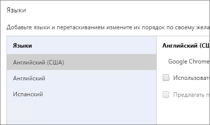
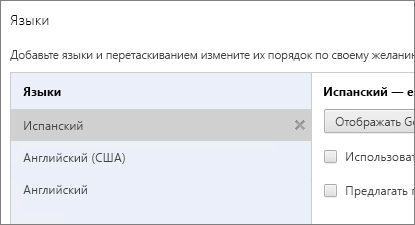
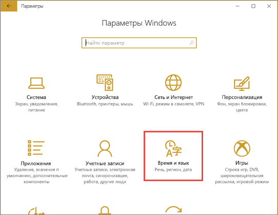
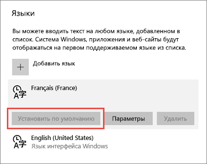
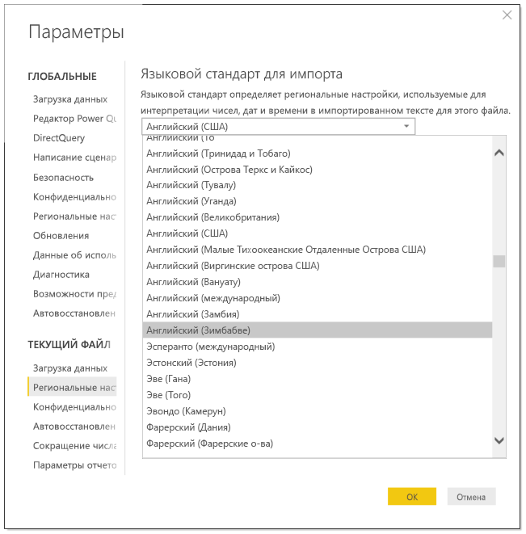
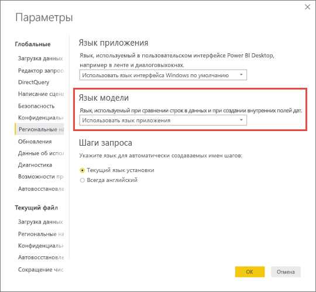

# Поддерживаемые языки и страны (регионы) для Power BI

В этой статье приводится список поддерживаемых языков и стран (регионов) для служб Power BI и Power BI Desktop, а также представлена документация по Power BI.

## Страны и регионы, в которых доступна служба Power BI
Перечень стран и регионов, в которых доступна служба Power BI, см. в [списке международной доступности](https://products.office.com/business/international-availability). 

## Локализация службы Power BI на другие языки
Служба Power BI (в браузере) доступна на 44 языках:

* Арабский
* Баскский — Basque
* Болгарский — Български
* Каталанский — català
* Китайский (упрощенное письмо) — 中文(简体)
* Китайский (традиционное письмо — 中文(繁體)
* Хорватский — hrvatski
* Чешский — čeština
* Датский — dansk
* Нидерландский — Nederlands
* Английский — English
* Эстонский — eesti
* Финский — suomi
* Французский — français
* Галисийский — galego
* Немецкий — Deutsch
* Греческий — Ελληνικά
* Иврит
* Хинди — हिंदी
* Венгерский — magyar
* Индонезийский — Bahasa Indonesia
* Итальянский — italiano
* Японский — 日本語
* Казахский — Қазақ
* Корейский — 한국어
* Латышский — latviešu
* Литовский — lietuvių
* Малайский — Bahasa Melayu
* Норвежский (букмол) — norsk (bokmål)
* Польский — Polski
* Португальский (Бразилия) — Português
* Португальский (Португалия) — português
* Румынский — română
* Русский — русский
* Сербский (кириллица) — српски
* Сербский (латиница) — srpski
* Словацкий — slovenčina
* Словенский — slovenski
* Испанский — español
* Шведский — svenska
* Тайский — ไทย
* Турецкий — Türkçe
* Украинский — українська
* Вьетнамский — Tiếng Việt

### Что переведено
Меню, кнопки, сообщения и другие элементы интерфейса переведены на ваш язык, что облегчает навигацию и взаимодействие с Power BI.

В настоящее время следующие возможности доступны только на английском языке:

* панели мониторинга и отчеты, которые Power BI создает при подключении к Microsoft Dynamics CRM, Google Analytics, Salesforce и т. д. (Вы можете создавать отчеты и панели мониторинга на вашем языке.)
* Просмотр данных с помощью вопросов и ответов.

Следите за обновлениями, поскольку мы работаем над переводом еще не локализованных компонентов на другие языки. 

### Выбор языка в службе Power BI
1. В службе Power BI щелкните значок **Параметры**  > **Параметры**.
2. На вкладке **Общие** выберите **Язык**.
3. Выберите язык и нажмите **Применить**.

### Выбор языка в браузере
Power BI определяет ваш язык на основе параметров языка на вашем компьютере. Способ доступа и изменения этих параметров зависит от операционной системы и браузера. Вот как можно получить доступ к этим параметрам из Internet Explorer и Google Chrome.

#### Internet Explorer (версия 11)
1. Нажмите кнопку **Сервис** в правом верхнем углу окна браузера:
   
   
2. Щелкните **Свойства браузера**.
3. В диалоговом окне "Свойства браузера" на вкладке "Общие" в разделе "Представление" нажмите кнопку **Языки**.

#### Google Chrome (версия 42)
1. Нажмите кнопку в правом верхнем углу окна браузера:
   
   
2. Щелкните **Настройки**.
3. Щелкните **Показать дополнительные настройки**.
4. В разделе "Языки" нажмите кнопку **Изменить языковые настройки**.
5. Щелкните **Добавить**, выберите язык и нажмите кнопку **ОК**.
   
   
   
   Новый язык появится в конце списка. 
6. Перетащите его в начало и нажмите кнопку **Отображать Google Chrome на этом языке**.
   
   
   
   Чтобы увидеть изменение, может потребоваться закрыть и снова открыть браузер.

## Выбор языка или языкового стандарта в Power BI Desktop
Получить Power BI Desktop можно одним из двух способов: скачать или установить из Магазина Windows.

* Если [Power BI Desktop устанавливается из Магазина Windows](#choose-a-language-for-power-bi-desktop-installed-from-the-windows-store), будут установлены все языки с отображением языка, который соответствует языку в Windows по умолчанию.
* Когда вы [скачиваете Power BI Desktop](#choose-a-language-when-you-download-power-bi-desktop), вы можете сразу выбрать язык. 
* Вы также можете [выбрать язык, который будет использоваться при импорте данных,](#choose-the-locale-to-be-used-when-importing-data-into-power-bi-desktop) для определенного отчета. 

### Выбор языка для программы Power BI Desktop, установленной из Магазина Windows
1. [Установите Power BI Desktop](http://aka.ms/pbidesktopstore) из Магазина Windows.
2. Чтобы изменить язык, на компьютере найдите **Параметры Windows**. 
3. Выберите **Время и язык**.
   
     
4. Щелкните **Регион и язык**, выберите язык и нажмите кнопку **Использовать как основной язык**.
   
     
   
     При следующем запуске Power BI Desktop будет использоваться язык, установленный как основной. 

### Выбор языка при скачивании Power BI Desktop
Выбранный для Power BI Desktop язык влияет на формат отображения чисел и дат в отчетах. 

* Выберите язык, когда вы [скачиваете Power BI Desktop](https://powerbi.microsoft.com/desktop). 

Чтобы изменить язык в Power BI Desktop, вернитесь на страницу загрузки и скачайте программу на другом языке.

### Выбор языкового стандарта для импорта данных в Power BI Desktop
Независимо от способа установки Power BI Desktop, вы можете выбрать языковой стандарт для отдельного отчета, отличный от языкового стандарта в вашей версии Power BI Desktop. Это изменит способ интерпретации данных, импортируемых из источника данных. Например, то как будет интерпретироваться дата 3/4/2017 — 3 апреля или 4 марта. 

1. В Power BI Desktop последовательно выберите **Файл** > **Параметры и настройки** > **Параметры**.
2. Под заголовком **Текущий файл** выберите **Региональные параметры**.
3. В поле **Языковой стандарт для импорта** выберите другой языковой стандарт. 
   
   
4. Нажмите кнопку **ОК**.

### Выбор языка для модели в Power BI Desktop

Вы можете не только выбрать язык для приложения Power BI Desktop, но также настроить язык модели. Язык модели влияет на две вещи:

- Способ сравнения и сортировки строк. Например, так как в турецком есть две буквы i, используемые в зависимости от параметров сортировки в базе данных, эти буквы могут оказаться в разной последовательности при сортировке. 
- Язык, используемый в Power BI Desktop при создании таблиц со скрытыми датами из полей дат. Например, поля могут называться Month/Monat/Mois и т. д.

> [!NOTE]
> Модель Power BI сейчас время использует языковой стандарт, в котором не учитывается регистр (или тип японской азбуки), следовательно, ABC и abc будут рассматриваться как эквивалент. Если в базу данных загружается ABC, другие строки, которые отличаются только регистром (например, Abc), не будут загружаться как отдельное значение.
> 
>

Вот как можно выбрать язык модели:

1. В Power BI Desktop последовательно выберите **Файл** > **Параметры и настройки** > **Параметры**.
2. В разделе **Глобальные** выберите **Региональные настройки**.
3. В поле **Язык модели** выберите другой язык. 

    

> [!NOTE]
> Язык созданной модели Power BI изменить нельзя.
> 
>

## Локализация справочной документации на другие языки
Справка локализована на 10 языков: 

* Китайский (упрощенное письмо) — 中文(简体)
* Китайский (традиционное письмо — 中文(繁體)
* Французский — français
* Немецкий — Deutsch
* Итальянский — italiano
* Японский — 日本語
* Корейский — 한국어
* Португальский (Бразилия) — Português
* Русский — русский
* Испанский — español

## Дальнейшие действия
* Вы используете одно из мобильных приложений Power BI? См. дополнительные сведения о [поддерживаемых языках в мобильных приложениях Power BI](mobile-apps-supported-languages.md).
* У вас появились вопросы? Попробуйте задать вопрос в [сообществе Power BI](http://community.powerbi.com/).
* Проблема до сих пор не устранена? Посетите [страницу поддержки по Power BI](https://powerbi.microsoft.com/support/).

