# Использование визуального элемента "Матрица" в Power BI
Визуальный элемент **Матрица** позволяет создавать визуальные элементы матрицы (которые иногда также называют *таблицами*) в отчетах **Power BI Desktop** и **службы Power BI**, а также перекрестно выделять элементы внутри матрицы с помощью других визуальных элементов. Кроме того, можно перекрестно выделять строки, столбцы и даже отдельные ячейки. Отдельные ячейки и несколько выбранных ячеек можно копировать и вставлять в другие приложения. Для более эффективного использования пространства макета в визуальном элементе "Матрица" поддерживается ступенчатый макет.

Предусмотрено множество функций для матрицы, которые мы рассмотрим в следующих разделах этой статьи.

## Темы отчетов
К визуальным элементам "Матрица" и "Таблица" можно применять стили (в том числе цвета) из выбранной **темы отчета**. Если вы хотите изменить цвета визуального элемента "Матрица", воспользуйтесь параметром **Тема отчета**. Дополнительные сведения о темах см. в статье [**Использование тем отчетов в Power BI Desktop**](../desktop-report-themes.md).

## Основные сведения о вычислении итогов в Power BI

Прежде чем использовать визуальный элемент **Матрица**, важно понять, как в Power BI вычисляются итоговое и промежуточные значения в таблицах и матрицах. Для строк итогов и промежуточных итогов мера вычисляется на основе всех строк в базовых данных. Это *не является* простым сложением всех значений в видимых или отображаемых строках. Это значит, что в результате значения в строке итогов могут отличаться от ожидаемых. 

Обратите внимание на следующие визуальные элементы **матрицы**. 

В этом примере в каждой строке визуального элемента **Матрица** справа отображается *сумма* для каждого сочетания даты и имени менеджера по продажам. Но так как для одного менеджера проводится сопоставление с несколькими датами, число может отображаться несколько раз. Таким образом, точное итоговое значение на основе базовых данных и простое сложение отображаемых значений не эквивалентны. Это распространенный подход, когда при суммировании значение представляет сторону "один" в связи "один ко многим".

Ч то касается итогов и промежуточных итогов, учитывайте, что эти значения основаны на базовых данных, а не на отображаемых значениях. 

<!-- use Nov blog post video

## Expanding and collapsing row headers
There are two ways you can expand row headers. The first is through the right-click menu. You’ll see options to expand the specific row header you clicked on, the entire level or everything down to the very last level of the hierarchy. You have similar options for collapsing row headers as well.

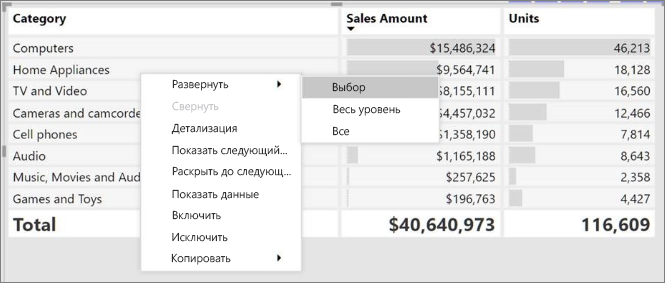

You can also add +/- buttons to the row headers through the formatting pane under the row headers card. By default, the icons will match the formatting of the row header, but you can customize the icons’ color and size separately if you want. 
Once the icons are turned on, they work similarly to the icons from PivotTables in Excel.

The expansion state of the matrix will save with your report. It can be pinned to dashboards as well, but consumers will need to open up the report to change the state. Conditional formatting will only apply to the inner most visible level of the hierarchy. Note that this expand/collapse experience is not currently supported when connecting to AS servers older than 2016 or MD servers.

Watch the following video to learn more about expand/collapse in the matrix:

-->
## Детализация с помощью визуального элемента "Матрица"
Визуальный элемент **Матрица** позволяет использовать подробные визуализации, недоступные ранее. Вы можете выполнить детализацию с использованием строк, столбцов и даже отдельных разделов и ячеек. Рассмотрим каждый из вариантов детализации.

### Детализация по заголовкам строк
В области **Визуализации** при добавлении нескольких полей в разделе **Строки** области **Поля** вы включаете детализацию по строкам визуального элемента "матрица". Это похоже на создание иерархии, которую затем можно детализировать (а потом обобщить), а также выполнить анализ данных на каждом уровне.

На следующем рисунке в разделе **Строки** содержатся элементы *Категория* и *Подкатегория*, формирующие группу (или иерархию) строк, которые можно детализировать.

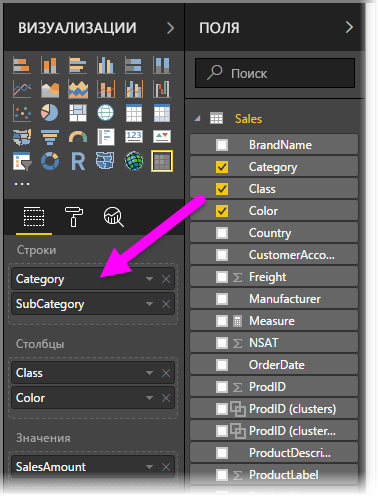

Если в разделе **Строки** для визуального элемента создана группа, в верхней левой части визуального элемента отображаются значки *детализации* и *развертывания*.

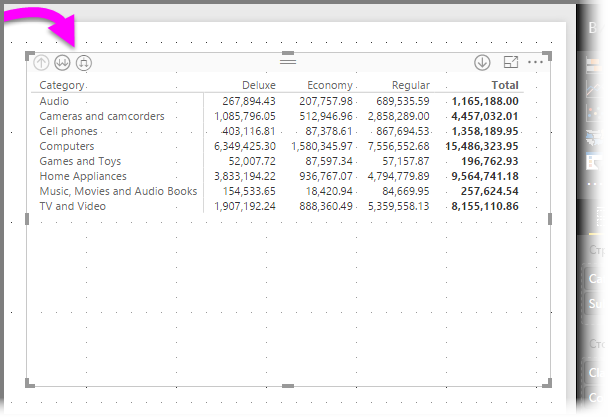

Эти кнопки действуют так же, как и подобные кнопки для детализации и развертывания в других визуальных элементах: они позволяют перемещаться по уровням элементов иерархии вниз (или вверх). В этом случае мы можем перейти от *категории* к *подкатегории*, как показано на следующем рисунке, на котором выбран значок перехода на один уровень (в виде разветвления).

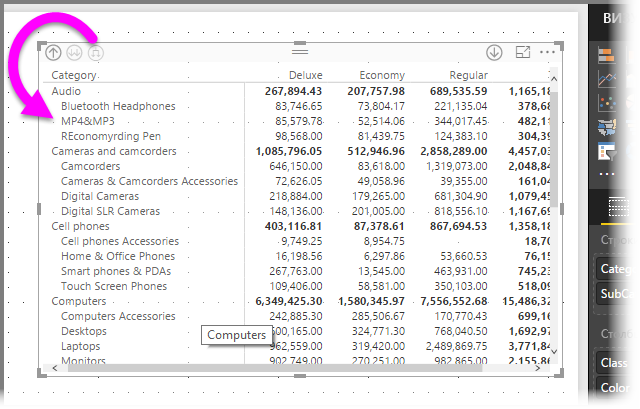

Помимо использования этих значков можно также щелкнуть любой из заголовков строк правой кнопкой мыши и выбрать пункт детализации в появившемся меню.

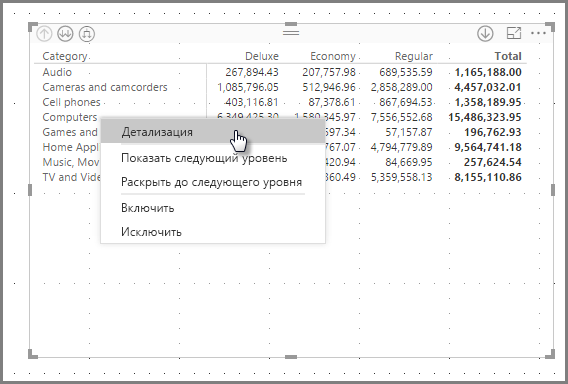

Обратите внимание, что в этом меню есть несколько параметров, используя которые вы получите разные результаты.

Если выбрать пункт **Детализация**, будет развернута матрица для *этого* уровня строки, *за исключением* других заголовков строк, кроме заголовка строки, выбранного с помощью правой кнопки мыши. На следующем рисунке мы щелкнули правой кнопкой мыши столбец *Компьютеры* и выбрали пункт **Детализация**. Обратите внимание, что другие строки верхнего уровня перестали отображаться в матрице. Этот способ детализации — полезная функция. Она очень пригодится, когда мы перейдем к разделу о **перекрестном выделении**.

Вы можете щелкнуть значок **Drill up** (Подняться), чтобы вернуться к предыдущему представлению верхнего уровня. Если затем в контекстном меню выбрать **Показать следующий уровень**, появится список всех элементов следующего уровня (в данном случае поле *Подкатегория*) в алфавитном порядке без категоризации иерархии верхнего уровня.

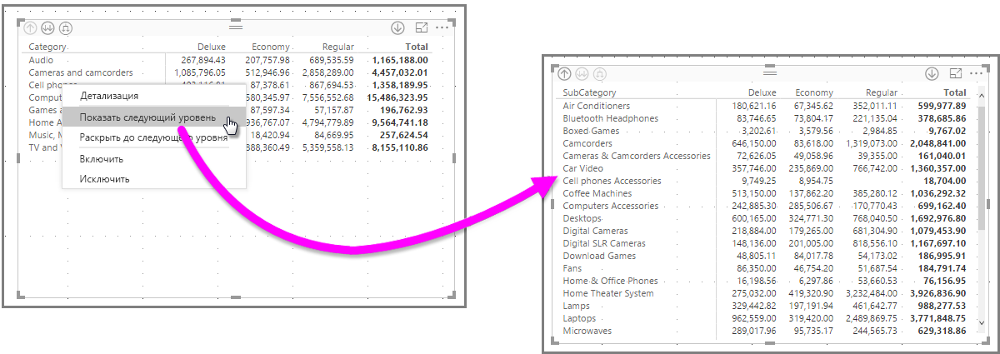

Если щелкнуть значок **Подняться** в верхнем левом углу, чтобы в матрице отобразились все категории верхнего уровня, а затем снова щелкнуть правой кнопкой мыши и выбрать команду **Раскрыть до следующего уровня**, вы увидите следующее.

Кроме того, вы можете использовать пункты меню **Include** (Включить) и **Исключить**, чтобы удалить или добавить соответственно в матрице строку (и все подкатегории), выделенную правой кнопкой мыши.

### Детализация по заголовкам столбцов
Аналогично детализации по строкам можно также выполнять детализацию по **столбцам**. На следующем рисунке видно, что в области полей **Столбцы** есть два поля, создающие иерархию, аналогичную той, которую мы использовали для строк ранее в этой статье. В области полей **Столбцы** есть поля *Класс* и *Цвет*.

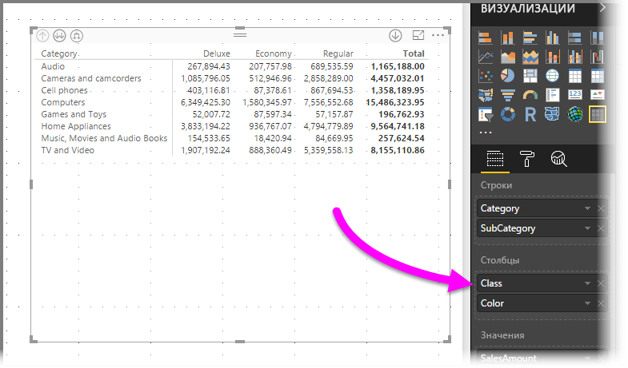

Если щелкнуть столбец правой кнопкой мыши в визуальном элементе **Матрица**, появится параметр детализации. На следующем рисунке мы щелкнули правой кнопкой мыши столбец *Люкс* и выбрали пункт **Детализация**.

При выборе пункта **Детализация** отображается следующий уровень в иерархии столбцов для столбца *Deluxe* (Люкс) (в данном случае — *Color* (Цвет)).

Остальные элементы контекстного меню действуют в столбцах так же, как в строках (см. предыдущий раздел о **детализации по заголовкам строк**). Вы можете **показать следующий уровень** для столбцов, **раскрыть их до следующего уровня**, **включить** или **исключить** так же, как для строк.

> [!NOTE]
> Значки детализации и перехода на уровень выше в верхнем левом углу визуального элемента "матрица" применяются только к строкам. Чтобы выполнить детализацию по столбцам, воспользуйтесь контекстным меню.
> 
> 

## Ступенчатый макет с визуальными элементами с матрицей
Визуальный элемент **Матрица** позволяет автоматически сделать отступы для подкатегорий в иерархии под каждой родительской категорией. Вот что собой представляет **ступенчатый макет**.

В *исходной* версии визуального элемента "Матрица" подкатегории отображались в отдельном столбце, занимая больше места в визуальном элементе. На следующем рисунке показана таблица в исходном визуальном элементе **Матрица**. Обратите внимание, что подкатегории находятся в отдельном столбце.

На следующем рисунке показан визуальный элемент **Матрица** со **ступенчатым макетом**. Обратите внимание, что в категории *Компьютеры* подкатегории ("Комплектующие для компьютеров", "Настольные компьютеры", "Ноутбуки", "Мониторы" и т. д.) немного сдвинуты. Таким образом визуальный элемент стал понятнее и меньше по размеру.

Параметры ступенчатого макета можно легко настроить. Выберите визуальный элемент **Матрица** и в области **Визуализации** в разделе **Формат** (значок в виде валика) разверните раздел **Заголовки строк**. У вас имеется два элемента: переключатель **Ступенчатый макет** (который включает или выключает этот макет) и параметр **Макет с пошаговым отступом** (позволяет указать уровень отступа в пикселях).

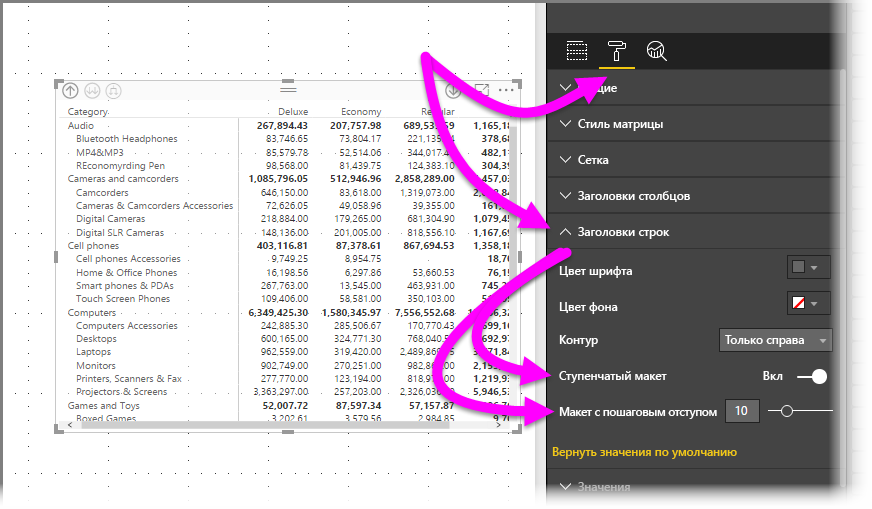

Если отключить **ступенчатый макет**, подкатегории будут отображаться в другом столбце, а не под родительской категорией.

## Промежуточные итоги с визуальными элементами матрицы
Промежуточные итоги можно включить или отключить в визуальных элементах матрицы для строк и столбцов. На следующем рисунке видно, что для строки промежуточных итогов задано значение **Включено**.

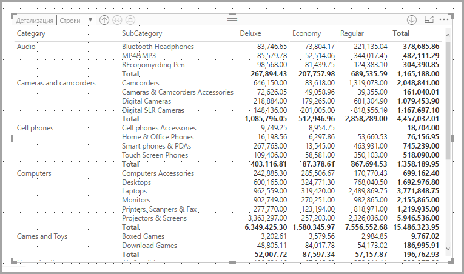

В разделе **Формат** на панели **Визуализации** разверните карту **Подытоги** и установите ползунок **Подытоги по строке** в положение **Выключено**. После этого действия подытоги больше не будут отображаться.

Для столбцов применяется тот же процесс.

## Перекрестное выделение с использованием визуальных элементов с матрицей
В визуальном элементе **Матрица** для перекрестного выделения вы можете выбрать все элементы в матрице. Выберите столбец в визуальном элементе **Матрица**, и он будет выделен, как и другие визуальные элементы на странице отчета. Этот способ перекрестного выделения был доступен для других визуальных элементов, а также при выборе точки данных. Теперь он реализован и для визуального элемента **Матрица**.

Кроме того, для перекрестного выделения можно также нажать клавишу CTRL и щелкнуть мышью. Например, на следующем рисунке в визуальном элементе **Матрица** выбрана коллекция подкатегорий. Обратите внимание, что элементы, которые не были выбраны в визуальном элементе, выделены серым цветом. Также оцените, как в других визуальных элементах на странице отражаются элементы, выбранные в визуальном элементе **Матрица**.

## Копирование значений из Power BI для использования в других приложениях

Матрица или таблица могут иметь содержимое, которое вы можете использовать в других приложениях, например Dynamics CRM, Excel, и даже в других отчетах Power BI. Щелчком правой кнопки мыши в Power BI можно скопировать одну ячейку или набор ячеек в буфер обмена, чтобы вставить их в другое приложение.

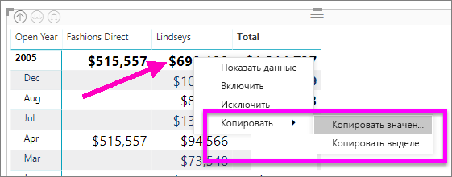

* Чтобы скопировать значение из одной ячейки, выделите нужную ячейку, щелкните ее правой кнопкой мыши и выберите **Копировать значение**. Значение ячейки без формата помещается в буфер обмена, откуда его можно вставить в другое приложение.

    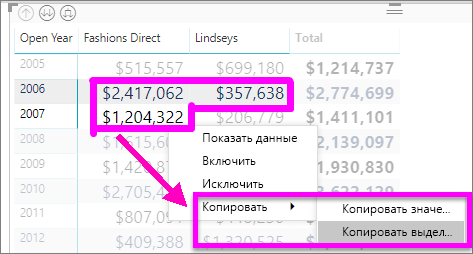

* Чтобы скопировать несколько ячеек сразу, выберите нужный диапазон ячеек или выберите несколько ячеек по очереди, удерживая клавишу CTRL. Такая копия будет содержать заголовки столбцов и строк.

    

## Цвет заливки и шрифта с визуальными элементами матрицы
С помощью визуального элемента **Матрица** можно применить **условное форматирование** (цвет и заливка) фона для ячеек в матрице, а также условное форматирование текста и значений.

Чтобы применить условное форматирование, можно выполнить одно из следующих действий при выборе визуального элемента матрицы:

* На панели **Поля** щелкните "Поле" правой кнопкой мыши и выберите в меню**Условное форматирование**.
  
  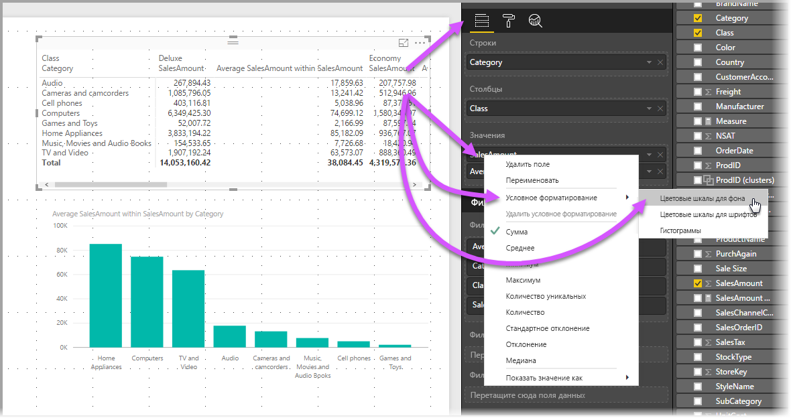
* Кроме того, на панели **Формат** разверните карту **Условное форматирование** для параметра **Background color scales** (Цветовая шкала фона) или **Font color scales** (Цветовая шкала шрифта) и установите ползунок в положение **Включено**. При включении любого из этих параметров отображается ссылка на *Расширенные элементы управления*, позволяющие настроить цвета и значения для форматирования цвета.
  
  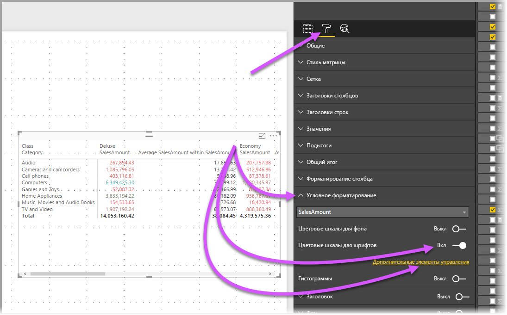

Любой из этих подходов обеспечивает такой же результат. При выборе *расширенных элементов управления* отображается следующее диалоговое окно, в котором можно внести изменения:

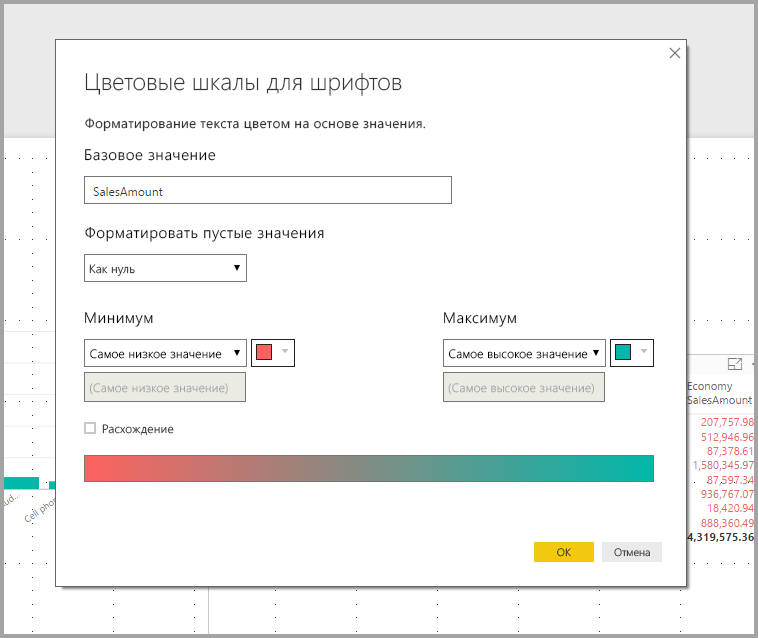

## Дальнейшие действия

[Точечные и пузырьковые диаграммы в Power BI](power-bi-visualization-scatter.md)

[Типы визуализаций в Power BI](power-bi-visualization-types-for-reports-and-q-and-a.md)