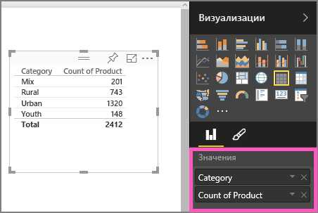
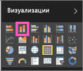

# Часть 1. Добавление визуализаций в отчет Power BI
В этой статье приводятся краткие сведения о создании визуализаций в отчетах с помощью службы Power BI и приложения Power BI Desktop.  Для получения более подробной информации [см. "Часть II"](power-bi-report-add-visualizations-ii.md). В этом видео Аманда покажет вам несколько разных способов создания, изменения и форматирования визуальных элементов на холсте отчетов. Теперь попробуйте сделать это сами, использовав раздел [Продажи и маркетинг — пример](../sample-datasets.md) для создания собственного отчета.

<iframe width="560" height="315" src="https://www.youtube.com/embed/IkJda4O7oGs" frameborder="0" allowfullscreen></iframe>

## Открытие отчета и добавление новой страницы
1. Откройте [отчет в режиме правки](../consumer/end-user-reading-view.md). В этом руководстве используется [образец "Продажи и маркетинг"](../sample-datasets.md).
2. Если панель "Поля" не отображается, щелкните значок со стрелкой, чтобы ее открыть. 
   
   
3. Добавьте пустую страницу в отчет.

## Добавление визуализаций к отчету
1. Создайте визуализацию, выбрав поле на панели **Поля** .  
   
   **Начните с числового поля**, например "Факт продажи" > "Продажи в долл. США". Power BI создаст гистограмму с одним столбцом.
   
   
   
   **Также можно начать с поля категории**, например "Имя" или "Продукт": Power BI создаст таблицу и добавит это поле в раздел **Значения**.
   
   
   
   **Кроме того, можно начать с поля для географических данных**, такого как "Геообъект" > "Город". Создание визуализации карты при помощи Power BI и Карт Bing.
   
   
2. Создайте визуализацию и измените ее тип. Выберите **Продукт > Категория**, а затем **Продукт > Число продуктов**, чтобы добавить эти поля в раздел **Значения**.
   
   
3. Измените визуализацию на гистограмму, выбрав значок гистограммы.
   
   
4. Созданные в отчете визуализации можно [закреплять на панели мониторинга](../service-dashboard-pin-tile-from-report.md). Чтобы закрепить визуализацию, выберите значок закрепления .
   
   
  

## Дальнейшие действия
 Перейти к статье [Часть 2. Добавление визуализаций в отчет Power BI](power-bi-report-add-visualizations-ii.md).
   
   [Взаимодействовать с визуализациями](../consumer/end-user-reading-view.md) в отчете.
   
   [Выполнять дополнительные действия с визуализациями](power-bi-report-visualizations.md).
   
   [Сохранить отчет](../service-report-save.md).
