# Визуализация ключевых факторов влияния
Визуализация ключевых факторов влияния поможет понять, какие факторы влияют на метрики, которые вас интересуют. Она анализирует данные, ранжирует факторы, которые важны, и отображает их в виде ключевых факторов влияния. Например, вы хотите понять, что влияет на текучку среди сотрудников. Одним из факторов может быть длина контракта, другим может быть возраст сотрудников. 
 
## Когда следует использовать ключевые факторы влияния? 
Визуализация ключевых факторов влияния отлично подходит, чтобы: 
- увидеть, какие факторы влияют на анализируемые метрики;

- сравнить относительную важность этих факторов. Например, оказывают ли краткосрочные контракты большее влияние на текучку,нежели долгосрочные? 

## Требования к ключевым факторам влияния 
Анализируемая метрика должна быть полем категории.    

## Возможности визуализации ключевых факторов влияния

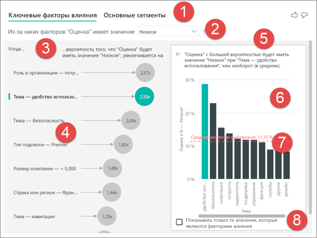    

1. ***Вкладки*** — выберите вкладку, чтобы переключаться между представлениями. Среди ключевых факторов влияния будут перечислены факторы, активнее всего участвующие в формировании выбранного значения метрики. Ведущие сегменты больше всего влияют на выбранное значение метрики. *Сегмент* состоит из сочетания значений.  Например, сегментом могут быть потребители в западном регионе, которые остаются нашими пользователями по крайней мере двадцать лет. 

2. ***Раскрывающийся список*** — значение рассматриваемой метрики. В этом примере у нас есть метрика **Оценка**, и мы выбрали значение **Низкая**.    

3. ***Пересмотр*** — помогает интерпретировать визуальный элемент в области слева. 

4. ***Область слева*** — левая панель содержит один визуальный элемент.  В этом случае слева показан список самых важных ключевых факторов влияния.

5. ***Пересмотр*** — помогает интерпретировать визуальный элемент в области справа.

6. ***Область справа*** — правая панель содержит один визуальный элемент. В этом случае гистограмма отображает все значения для **ключевого фактора влияния** — **темы**, выбранной на панели слева. Определенное значение (**удобство использования**) в левой области выделено зеленым цветом; все остальные значения для **темы** выделены черным цветом.

7. ***Линия среднего значения*** — вычисляется среднее значение для всех других возможных значений **темы**, за исключением **удобства использования**. Поэтому вычисление применяется ко всем значениям, выделенным черным цветом. Это указывает, какой процент других **тем** дает нам низкую оценку. Другими словами, получая оценку от пользователя, мы также получаем описание причины или **тему** для оценки. Некоторые темы: удобство использования, скорость, безопасность и т. д. Такая **тема**, как **удобство использования**, является вторым по значимости ключевым фактором влияния на низкую оценку в соответствии с нашим визуальным элементом в области слева. Если мы возьмем среднее значение всех других тем и их вклада в **низкой** оценке, мы получаем результат, показанный ниже красным цветом. 

8. ***Флажок*** — показывать только те значения, которые являются факторами влияния.

## Создание визуализации для ключевых факторов влияния 
 
Просмотрите это видео, чтобы научиться создавать визуализацию для ключевых факторов влияния, а затем выполните следующие действия, чтобы создать ее. 

<iframe width="560" height="315" src="https://www.youtube.com/embed/fDb5zZ3xmxU" frameborder="0" allow="accelerometer; autoplay; encrypted-media; gyroscope; picture-in-picture" allowfullscreen></iframe>

Наш менеджер по продуктам хочет определить факторы, заставляющие пользователей оставлять отрицательные отзывы о нашей облачной службе.  Откройте [PBIX-файл с примером отзывов пользователей](https://github.com/Microsoft/powerbi-desktop-samples/blob/master/2019/customerfeedback.pbix) в Power BI Desktop. Вы также можете скачать [файл Excel с отзывами пользователей службы Power BI или Power BI Desktop](https://github.com/Microsoft/powerbi-desktop-samples/blob/master/2019/customerfeedback.xlsx). 

> [!NOTE]
> Набор данных основан на следующей работе: [Moro et al., 2014] S. Moro, P. Cortez and P. Rita. A Data-Driven Approach to Predict the Success of Bank Telemarketing. Decision Support Systems, Elsevier, 62:22-31, June 2014 

1. Откройте отчет и выберите вкладку "Ключевые факторы влияния".  

    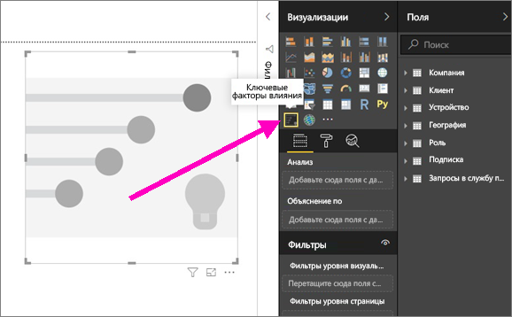

2. Перетащите метрику, которую необходимо изучить, в поле **Анализ**. Поле **Анализ** поддерживает только категориальные (дискретные) переменные. Так как нас интересует, почему клиенты дают нашей службе **низкие** оценки, мы выбираем пункты **Таблица пользователей** > **Оценка**.    
3. Затем необходимо перетащить поля, которые, как вы считаете, могут повлиять на **Оценку**, в поле **Объяснение по**. Можно перетащить любое количество полей. В этом случае мы начинаем со следующих. 
    - Страна или регион 
    - Роль в организации 
    - Тип подписки 
    - Размер компании 
    - Тема     
4. Так как нас интересуют отрицательные оценки, выберите значение **Низкая** в раскрывающемся списке **Что влияет на значение метрики "Оценка"**.  

    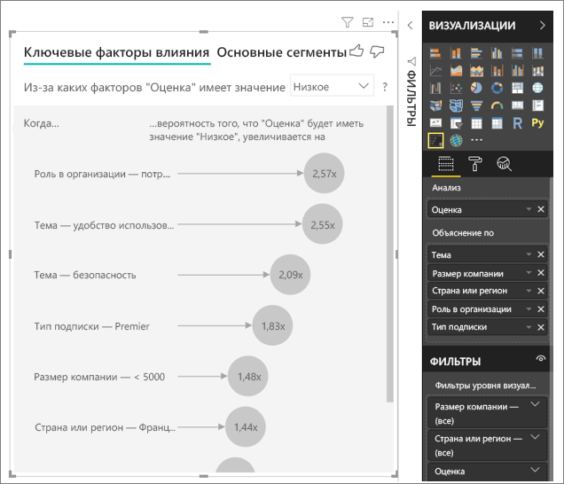

Анализ поля выполняется на уровне таблицы. В этом случае нас интересует метрика **Оценка**, которая определена на уровне клиента (у каждого пользователя есть либо высокая оценка, либо низкая). Все наши пояснительные факторы должны быть определены на уровне пользователя, чтобы визуализация могла их использовать. 

В приведенном выше примере все пояснительные факторы имеют связь "один к одному" или "многие к одному" с нашей метрикой. Например, каждый показатель связан ровно с одной темой (это основная тема отзыва пользователя). Аналогичным образом пользователи находятся в одной стране, имеют один тип членства и одну роль в своей организации. Наши пояснительные факторы, следовательно, уже являются атрибутами пользователя, преобразования не требуются: визуальный элемент можно сразу использовать без них. 

Позже в этом руководстве мы рассмотрим более сложные примеры, где у нас есть связь "один ко многим". В таком случае столбцы должны сначала пройти агрегацию на уровне пользователя перед выполнением анализа.  

Меры и агрегаты, используемые как пояснительные факторы, также вычисляются на уровне таблицы метрики **Анализ**, и вы увидите некоторые примеры далее в этой статье. 

## Интерпретация категориальных ключевых факторов влияния 
Давайте рассмотрим наши ключевые факторы влияния для низкой оценки. 

### Ведущий фактор, влияющий на вероятность низкой оценки

В нашей организации есть три роли: потребители, администраторы и издатели. Мы видим, что потребитель является ведущим фактором, оказывающим влияние на низкую оценку. 

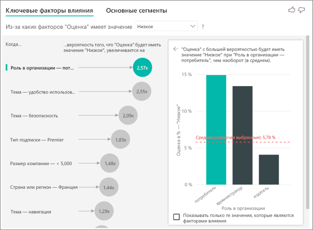

Точнее говоря, наши потребители в 2,57 раза более склонны отправить нам отрицательную оценку. На диаграмме ключевых факторов влияния **роль в организации — потребитель** указана первой в списке в левой части. При выборе **роли в организации — потребитель** Power BI показывает дополнительные сведения на панели справа — сравнительное влияние каждой **роли** на вероятность низкой оценки.
  
- 14,93 % потребителей дают низкую оценку.  
- В среднем все остальные роли дают низкую оценку в 5,78 % случаев. 
- Следовательно, потребители в 2,57 раза более склонны дать низкую оценку по сравнению со всеми остальными ролями (разница между зеленой полосой и красной пунктирной линией). 

### Второй по значимости фактор, влияющий на вероятность низкой оценки

Визуализация ключевых факторов влияния дает возможность сравнения и ранжирования факторов с множеством разнообразных переменных.  Наши второй фактор влияния не имеет ничего общего с **ролью в организации**.  Выберите второй фактор влияния в списке; это **Тема — удобство использования**. 

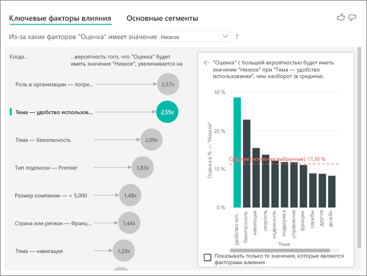

Здесь мы видим, что вторым по важности фактором является тема отзыва пользователя. Пользователи, которые оставляют отзывы про *удобство использования* продукта, в 2,21 раза более склонны дать низкую оценку по сравнению с пользователями, которые оставляют отзывы на другие темы, такие как надежность, дизайн или скорость. 

Вы увидите по визуализации, что среднее значение (красная пунктирная линия) изменилось с 5,78 на 11,34 %. Среднее значение является динамическим, поскольку оно основано на среднем арифметическом всех значений. В случае первого фактора влияния из среднего была исключена роль пользователя, тогда как в случае второго фактора оно исключает тему "Удобство использования". 
 
Установка флажка в нижней части визуального элемента приведет к фильтрации только по важным значениям (здесь — по ролям, которые сопутствуют низкой оценке). Таким образом, мы переходим от двенадцати тем к четырем, которые Power BI определяет как факторы низкой оценки. 

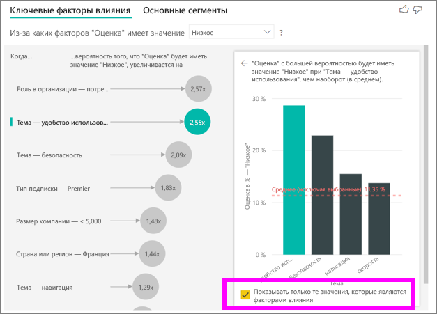

## Взаимодействие с другими визуальными элементами 
 
Каждый раз при щелчке среза, фильтра или других визуальных элементов на холсте визуализация ключевых факторов влияния повторно выполняет анализ новой порции данных. Например, давайте перетащим размер компании в отчет и используем его в качестве среза. Мы хотим видеть, как ключевые факторы влияния для наших корпоративных пользователей (в компании больше 50 000 сотрудников) отличаются от общей совокупности.  
 
Выбрав **> 50 000**, мы повторно запускаем анализ и сможем увидеть, что основные факторы изменились. Для крупных корпоративных пользователей самым влиятельным фактором низкой оценки будет **тема**, связанная с **безопасностью**. Мы можем продолжать исследование, чтобы узнать о наличии конкретных факторов безопасности, волнующих наших крупных пользователей. 

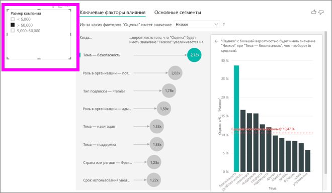

## Интерпретация непрерывных ключевых факторов влияния 
 
Пока что мы использовали визуальный элемент для оценки того, как различные поля категорий могут повлиять на низкие оценки. Можно также использовать непрерывные факторы (например, возраст, высота, цена) в поле "Объяснение по". Давайте посмотрим, что произойдет, если мы уберем срок использования из таблицы пользователей в разделе "Объяснение по". Здесь указано, как долго пользователь использует службу. 
 
Мы видим, что по мере роста **срока использования** увеличивается вероятность получения низкой оценки. Эта тенденция предполагает, что наши долгосрочные пользователи более склонны дать отрицательную оценку, что весьма интересно для изучения в дальнейшем.  
 
Визуализация сообщает нам, что увеличение срока на 13,44 месяца в среднем увеличивает вероятность низкой оценки в 1,23 раза. В этом случае 13,44 месяца — это среднеквадратичное отклонение срока использования. Поэтому наше открытие состоит в том, как увеличение срока использования на стандартное отклонение влияет на вероятность получения низкой оценки. 
 
Точечная диаграмма в области справа отображает средний процент низкой оценки для каждого значения срока, а также линию тренда для выделения наклона.  

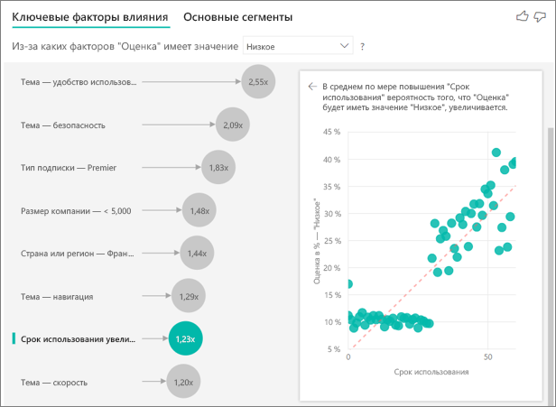

## Интерпретация мер и агрегатов как ключевых факторов влияния 
 
Наконец, пользователи могут также использовать меры и агрегаты в качестве пояснительных факторов в ходе своего анализа. Например, может потребоваться узнать, какое влияние оказывает число запросов в службу поддержки или средний срок жизни открытого запроса на оценку, которую мы получаем. 
 
В этом случае мы хотим видеть, влияет ли количество запросов в службу поддержки на оценку потребителя. Мы собираемся использовать идентификатор запроса в службу поддержки из таблицы службы поддержки. Так как пользователь может отправить несколько запросов в службу поддержки, необходимо агрегировать идентификатор на уровне клиента. Это важно, поскольку мы запускаем анализ на уровне пользователя, а значит, все факторы должны быть определены на этом уровне детализации. 
 
Мы рассмотрим число идентификаторов (чтобы каждая строка пользователя содержала количество запросов в службу поддержки, связанных с ним). В этом случае мы видим, что с ростом количества обращений вероятность низкой оценки увеличивается в 5,51 раза. Правая визуализация показывает среднее количество запросов в службу поддержки для различных значений оценки (вычисляется на уровне пользователя). 

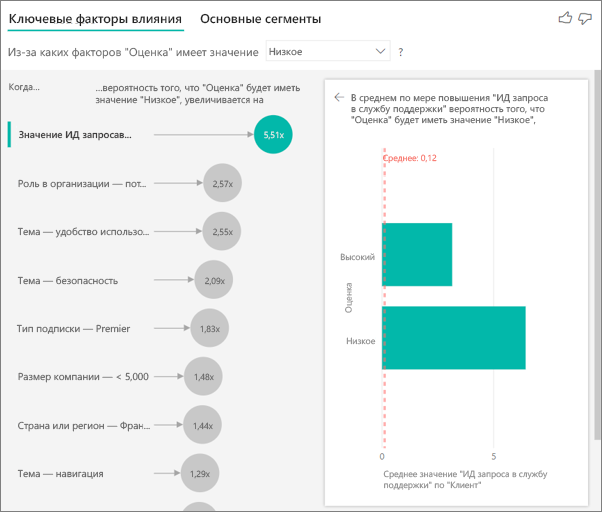

## Интерпретация результатов: ведущие сегменты 
 
Хотя вкладка "Ключевые факторы влияния" позволяет пользователям оценивать каждый фактор по отдельности, пользователи могут переключаться на "Ведущие сегменты", чтобы увидеть, как сочетание факторов влияет на анализируемую метрику. 
 
Ведущие сегменты изначально содержат обзор всех сегментов, обнаруженных с помощью Power BI. В следующем примере мы видим, что найдено шесть сегментов. Эти сегменты ранжируются по проценту низких оценок. Мы увидим, что у сегмента 1, например, 74,3 % оценок — низкие.  Чем больше пузырек, тем выше доля низких оценок. Размер пузырька с другой стороны означает, сколько пользователей в сегменте. 

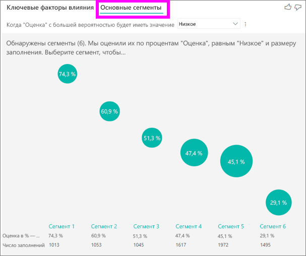

Выбор пузырьков открывает детали сегмента. Если для примера мы выберем сегмент 1, обнаружим, что он состоит из относительно стабильных пользователей (работают с нами более 29 месяцев), отправивших большое число (больше 4) запросов в службу поддержки. Наконец, они не являются издателями (поэтому они либо потребители, либо администраторы).  
 
В этой группе 74,3 % потребителей дали низкую оценку. Средний пользователь дает низкую оценку в 11,7 % случаев, поэтому этот сегмент имеет гораздо большую долю низких оценок (на 63 % выше). Мы также видим, что сегмент 1 содержит 2,2 % от общего объема данных, поэтому он представляет значимую долю популяции. 

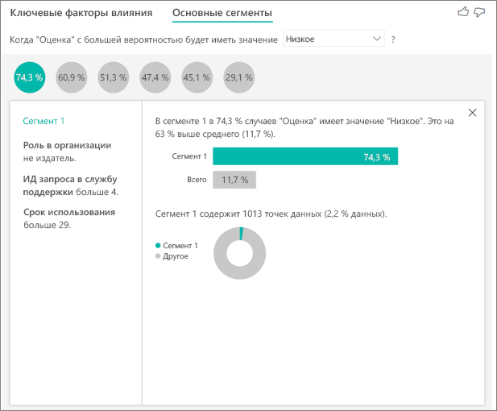

## Рекомендации и устранение неполадок 
 
**Каковы ограничения предварительной версии?** 
 
Визуализация ключевых факторов влияния в настоящее время находится в общедоступной предварительной версии; существует несколько ограничений, о которых пользователи должны помнить. Функциональные возможности, недоступные в настоящее время. 
- Анализ метрик, представляющих собой агрегаты и меры. 
- Использование визуального элемента со встраиванием. 
- Использование визуального элемента в Power BI для мобильных устройств. 
- Поддержка RLS. 
- Поддержка Direct Query. 
- Поддержка Live Query. 
 
**Я вижу ошибку, которая гласит, что факторы влияния или сегменты не обнаружены. Почему так происходит?**  

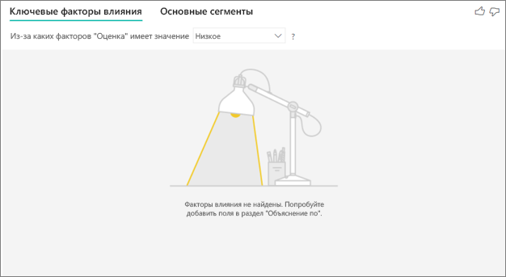

Эта ошибка возникает, когда вы включили поля в раздел **Объяснение по**, но факторы влияния не обнаружены.   
- Вы включили анализируемую метрику и в раздел "Анализ", и в раздел "Объяснить по" (ее следует удалить из раздела **Объяснить по**). 
- Пояснительные поля имеют слишком большое число категорий с небольшим числом наблюдений. Это затрудняет визуализацию, не позволяя определить, какие факторы являются факторами влияния, так как трудно сделать обобщения на основе небольшого количества наблюдений. 
- Ваш пояснительные факторы содержат достаточное количество наблюдений, чтобы сделать обобщения, но визуализация не позволяет найти значимых корреляций. 
 
**Я вижу ошибку, которая гласит, что по анализируемой метрики недостаточно данных для анализа. Почему так происходит?**  

Визуализация работает, проверяя закономерности в данных для одной группы (например, "Пользователи, которые дали низкие оценки") по сравнению с другими группами (например, "Пользователи, которые дали высокие оценки"). Если данные в модели содержат очень мало наблюдений, трудно найти шаблоны. Если в визуализации недостаточно данных для поиска значимых факторов влияния, она укажет, что необходимые дополнительные данные для анализа. Рекомендуется по крайней мере 100 наблюдений для выбранного состояния (уходящие пользователи) и по крайней мере 10 наблюдений для состояний, которые вы используете для сравнения (пользователи, которые не уходят).  
 
**Я вижу ошибку, которая гласит, что поле в "Объяснение по" не связано однозначно с таблицей анализируемой метрики. Почему так происходит?**  
 
Анализ поля выполняется на уровне таблицы. Например, при анализе отзывов пользователей службы возможно наличие таблицы, которая сообщает, дал потребитель высокую оценку или низкую. В этом случае анализ будет выполняться на уровне таблицы пользователей. 

Если есть связанная таблица, которая определена на более детальном уровне, чем таблица, содержащая метрику, вы получите эту ошибку. Рассмотрим эту ситуацию на примере. 
 
- Вы анализируете, почему пользователи дают низкие оценки службе. 
- Вам интересно понять, влияют ли устройства, на которых пользователи пользуются вашей службой, на оценку. 
- Пользователь может использовать службу несколькими разными способами.   
- В приведенном ниже примере пользователь 10000000 использует для взаимодействия со службой планшет и браузер. 

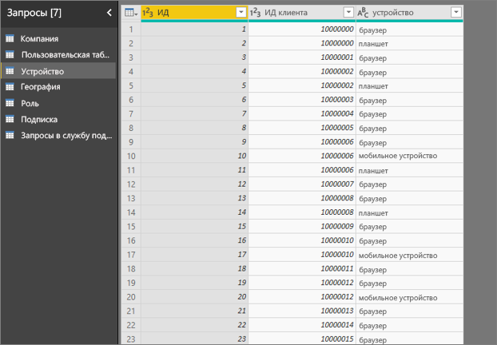

При попытке использовать столбец устройства как пояснительный фактор появится следующая ошибка. 

Она возникает потому, что устройство не определено на уровне пользователя, — один пользователь может использовать службу на нескольких устройствах. Чтобы визуализация могла найти шаблоны, устройство должно стать атрибутом пользователя. В этом случае у меня есть несколько решений в зависимости от моего понимания бизнеса. 
 
- Я могу изменить способ формирования сводных данных по устройствам, например подсчитать их, если я думаю, что количество устройств влияет на оценку пользователя. 
- Можно воспользоваться сводкой по столбцу устройств, чтобы увидеть, как использование службы на конкретном устройстве влияет на оценку пользователя  
 
В этом примере я свожу данные для создания новых столбцов для браузеров, мобильных устройств и планшетов. Теперь я могу использовать их в поле "Объяснение по". Мы обнаружим, что все устройства оказываются факторами влияния, и браузер оказывает наибольшее влияние на оценку пользователя. 

Говоря точнее, пользователи, не использующие браузер для работы со службой, в 3,79 раза более склонны дать низкую оценку. Мы видим ниже в списке, что в случае мобильных устройств верно обратное. Пользователи, которые пользуются мобильным приложением, чаще дают низкие оценки.  

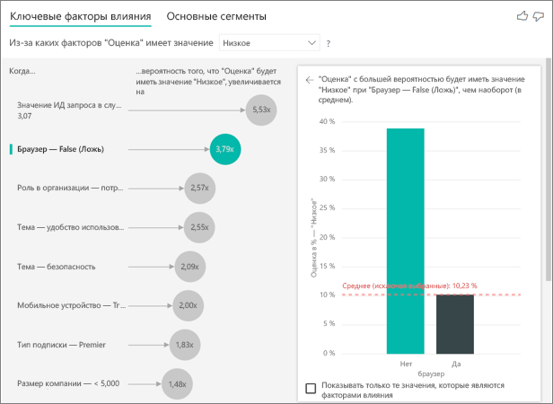

**Я вижу предупреждение о том, что в мой анализ не включены меры. Почему так происходит?** [2052261] 

Анализ поля выполняется на уровне таблицы. При анализе оттока клиентов возможно наличие таблицы, которая сообщает, ушел пользователь или нет. В этом случае анализ будет выполняться на уровне таблицы пользователей.
 
Меры и агрегаты по умолчанию анализируются на этом уровне таблицы. Если бы у нас была мера "Средние ежемесячные расходы", анализируемая на уровне таблицы пользователей.  

Если в таблице пользователей отсутствует уникальный идентификатор, мы не сможем оценить меру и она пропускается в ходе анализа. Чтобы избежать этого, убедитесь, что таблица с метрикой (в нашем примере это таблица пользователей) имеет уникальный идентификатор (например, идентификатор пользователя). Можно также просто добавить столбец индекса с помощью Power Query.
 
**Я вижу предупреждение о том, что анализируемая метрика имеет более 10 уникальных значений и что это может повлиять на качество анализа. Почему так происходит?**  

ИИ визуализации оптимизирован для анализа категорий (например, отток — "Да" или "Нет", удовлетворенность клиентов — "Высокая", "Средняя" или "Низкая" и т. д.) Увеличение числа категорий анализа означает, что у нас уменьшается количество наблюдений на одну категорию, что мешает визуализации искать шаблоны в данных. 

Чтобы найти более надежные факторы влияния, мы рекомендуем группировать похожие значения. Например, если у вас есть метрика по цене, вполне вероятно, вы получите более точные результаты путем объединения цен в сегменты "Высокий", "Средний", "Низкий", чем на основе отдельных цен. 

**В данных есть факторы, похожие на ключевые факторы влияния, но они не выявляются. Почему это происходит?**

В следующем примере мы видим, что пользователи, которые являются потребителями, дают низкие оценки (14,93 % оценок). Что интересно, на роль администратора также приходится большая часть низких оценок (13,42 %), но она не считается фактором влияния. 

Причина в том, что визуализация также учитывает количество точек данных при поиске факторов влияния. В следующем примере у нас есть более 29 000 потребителей и в 10 раз меньше администраторов (около 2900). Кроме того, только 390 из них дали низкую оценку. Таким образом, визуализации не хватает данных, чтобы определить, по-настоящему ли существует шаблон для оценок администраторов или это просто случайность.  

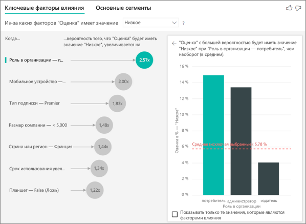

**Как выводятся ключевые факторы влияния?**

На самом деле ИИ визуализации выполняет логистическую регрессию для вывода ключевых факторов влияния. Логистическая регрессия — это статистическая модель, которая сравнивает различные группы друг с другом. Если требуется найти, в чем причина низких оценок, логистическая регрессия будет смотреть, как пользователи, которые дали низкую оценку, отличаются от тех, кто дал высокую оценку. Если у нас было несколько категорий (высокая оценка, нейтральна оценка, низкая оценка), мы бы проверили, как те, кто дал низкую оценку, отличаются от пользователей, которые не дали низкую оценку (от тех, кто дал высокую или нейтральную). 
 
Логистическая регрессия ведет поиск закономерностей в данных, ища, как пользователи, которые дали низкую оценку, могут отличаться от тех, кто дал высокую оценку. Она может обнаружить, например, что у пользователей, отправивших больше запросов в службу поддержки, выше процент низких оценок, чем у тех, кто не отправлял или почти не отправлял запросов.
 
Логистическая регрессия также учитывает количество точек данных. Если, например, пользователи, которые играют роль администратора, дают заметно более негативные оценки, но таких пользователей немного, их наличие не считается важным фактором. Причина в том, что для выявления шаблона недостаточно точек данных. Статистический тест (тест Вальда) используется, чтобы определить, считать ли фактор фактором влияния. Визуализация использует пороговое значение 0,05. 
 
**Как рассчитываются сегменты?**

Внутри ИИ визуализации использует дерево принятия решений для поиска интересных подгрупп. Цель дерева принятия решений — найти подгруппу точек данных с относительно высоким уровнем метрики, которая нам нужна (например, пользователей, которые дали низкую оценку). 

Дерево принятия решений рассматривает каждый пояснительный фактор и пытается понять, какой фактор даст оптимальное разделение. Например, если мы отфильтруем данные для включения только крупных пользователей, позволит ли это разделить пользователей, которые дали нам высокую оценку или низкую? Или, возможно, будет лучше, если мы отфильтруем данные, включив только тех клиентов, которые добавили комментарий о безопасности? 

Когда дерево принятия решений выполняет разбиение, оно рассматривает подгруппу данных (например, пользователей, отзывавшихся о безопасности) и пытается выяснить, каким будет следующее наилучшее разделение только для этих данных. После каждого разбиения оно также учитывает, есть ли достаточное количество точек данных для обеспечения репрезентативности группы, чтобы определить шаблон, или это просто аномалия в данных, а не реальный сегмент. (Другой применяемый статистический тест — проверка на статистическую значимость условия разбиения по значению p 0,05). 

После построения дерева принятия решений оно принимает все разделения (комментарии по безопасности, крупные пользователи) и создает фильтры Power BI. Сочетание фильтров будет упаковано в виде сегмента в визуализации. 
 
**Почему определенные факторы становятся факторами влияния или перестают быть ими, когда я перетаскиваю дополнительные поля в раздел "Объяснение по"?**

Визуализация оценивает все пояснительные факторы вместе. Это означает, что сам по себе фактор может быть фактором влияния, но в сочетании с другими — нет. Представьте, что мы анализируем, в чем причина роста цены на дома, используя число спален и площадь дома как пояснительные факторы. 
- Сами по себе дополнительные спальни могут быть фактором влияния на рост цены дома. 
- Включение размера дома в анализ означает, что теперь мы видим, что происходит с числом спален, если зафиксировать размер дома как 
- 140 кв. м: маловероятно, что, постоянно увеличивая число спален, можно существенно увеличить стоимость дома; число спален становится не так важно, если мы принимаем во внимание площадь. 

## Дальнейшие действия
[Комбинированная диаграмма в Power BI](power-bi-visualization-combo-chart.md)

[Типы визуализаций в Power BI](power-bi-visualization-types-for-reports-and-q-and-a.md)
