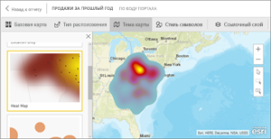
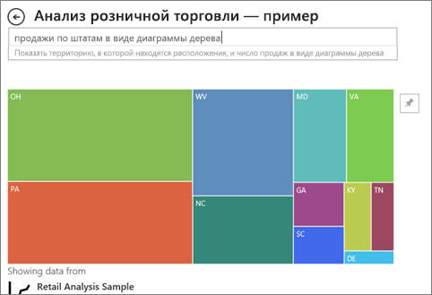

# Типы визуализаций в Power BI
## Визуализации Power BI
Постепенно мы будем добавлять новые визуализации, следите за обновлениями!

Перейдите в [Microsoft AppSource](https://appsource.microsoft.com/marketplace/apps?product=power-bi-visuals), где находится постоянно пополняющийся список [ пользовательских визуальных элементов](../power-bi-custom-visuals.md), которые можно скачать и использовать в своих панелях мониторинга и отчетах. Чувствуете творческий порыв? [Узнайте, как создавать свои собственные визуальные элементы и добавлять их на сайт сообщества](../developer/office-store.md).  

## Список визуализаций, доступных в Power BI
Все эти представления могут быть добавлены в отчеты Power BI, указанные в вопросах и ответах, и закреплены на панелях мониторинга.

### Диаграммы с областями: базовые (многоуровневые) и с накоплением

>[!TIP]
>Базовая диаграмма с областями основана на графике, у которого заполнена область между осью и линией графика.

Дополнительные сведения см. в разделе [Tutorial: Basic Area chart](power-bi-visualization-basic-area-chart.md) (Учебник: основная диаграмма с областями).

### Линейчатые диаграммы и гистограммы
 

 

>[!TIP]
>Линейчатые диаграммы лучше всего подходят для рассмотрения определенного значения по разным категориям.

### Карточки: многострочные

### Карточки: с одним числом

Дополнительные сведения см. в статье [Визуализация карточек](power-bi-visualization-card.md).

### Комбинированные диаграммы

>[!TIP]
>Комбинированная диаграмма сочетает в себе гистограмму и график. Выберите *Линейную гистограмму и гистограмму с накоплением* или *Линейную гистограмму и гистограмму с группировкой*.

Дополнительные сведения см. в разделе [Tutorial: Combo charts in Power BI](power-bi-visualization-combo-chart.md) (Учебник: комбинированные диаграммы в Power BI).

### Кольцевые диаграммы

>[!TIP]
>Кольцевые диаграммы похожи на круговые диаграммы.  Они показывают отношение частей к целому.

Дополнительные сведения см. в статье [Tutorial: Doughnut charts in Power BI](power-bi-visualization-doughnut-charts.md) (Учебник: кольцевые диаграммы в Power BI).

### Воронкообразные диаграммы

>[!TIP]
>Воронкообразные диаграммы помогают визуализировать процесс, состоящий из этапов, в котором элементы последовательно переходят от одного этапа к другому.  Используйте воронкообразные диаграммы, когда между этапами выполняется последовательность операций, например процесса продаж, который начинается с интересов и заканчивается осуществлением покупки.

Дополнительные сведения см. в разделе [Tutorial: Funnel Charts in Power BI](power-bi-visualization-funnel-charts.md) (Учебник: воронкообразные диаграммы в Power BI).

### Индикаторные диаграммы

>[!TIP]
>Отображает текущее состояние в контексте цели.

Дополнительные сведения см. в разделе [Tutorial: Gauge Charts in Power BI](power-bi-visualization-radial-gauge-charts.md) (Учебник: индикаторные диаграммы в Power BI).

### Ключевые показатели эффективности

>[!TIP]
>Отображает ход достижения измеримой цели.

Дополнительные сведения см. в статье [КПЭ в Power BI](power-bi-visualization-kpi.md).

### Графики

>[!TIP]
>Подчеркивает общую форму целой последовательности значений, обычно в зависимости от времени.

### Карты: базовые

>[!TIP]
>Используются для сопоставления информации о категориях и количественной информации с пространственными расположениями.

Дополнительные сведения см. в разделе [Советы и рекомендации для визуализаций карт Power BI](power-bi-map-tips-and-tricks.md).

### Карты: карты ArcGIS

Дополнительные сведения см. в статье [Руководство. Карты ArcGIS в Power BI (предварительная версия)](../power-bi-visualization-arcgis.md).

### Карты: картограммы (хороплеты)

>[!TIP]
>Чем насыщеннее цвет, тем больше значение.

Дополнительные сведения см. в разделе [Tutorial: Filled Maps in Power BI](power-bi-visualization-filled-maps-choropleths.md) (Учебник: картограммы в Power BI).

### Матрица

### Круговые диаграммы

### Точечные и пузырьковые диаграммы

>[!TIP]
>Отображают отношения между 2 (точечные) или 3 (пузырьковые) количественными показателями — существуют или нет, в каком порядке и т. д.

Дополнительные сведения см. в разделе [Tutorial: Scatter charts in Power BI](power-bi-visualization-scatter.md) (Учебник: точечные диаграммы в Power BI).

### Срезы

Дополнительные сведения см. в разделе [Tutorial: Slicers in Power BI](power-bi-visualization-slicers.md) (Учебник: срезы в Power BI).

### Автономные изображения

Дополнительные сведения см. в статье [Добавление изображения на панель мониторинга](../service-dashboard-add-widget.md).

### Таблицы

>[!TIP]
>Хорошо подходят для количественного сравнения элементов при большом числе категорий.

Дополнительные сведения см. в статье [Работа с таблицами в отчетах и на информационных панелях Power BI (руководство)](power-bi-visualization-tables.md).

### Плоские деревья

Дополнительные сведения см. в разделе [Tutorial: Treemaps in Power BI](power-bi-visualization-treemaps.md) (Учебник. Плоские деревья в Power BI).

>[!TIP]
>Это диаграммы из цветных прямоугольников, размер которых соответствует значению.  Они могут иметь иерархическую структуру, в которой прямоугольники вкладываются в основные прямоугольники.

### Каскадные диаграммы

>[!TIP]
>Каскадные диаграммы показывают промежуточный итог по мере сложения или вычитания значений.

Дополнительные сведения см. в разделе [Tutorial Waterfall charts in Power BI](power-bi-visualization-waterfall-charts.md) (Учебник: каскадные диаграммы в Power BI).

## Назначение используемой визуализации для вопросов и ответов
При вводе запросов на естественном языке с помощью вопросов и ответов Power BI можно указать тип визуализации в запросе.  Например:

"***продажи по штатам в виде плоского дерева***"

## Дальнейшие действия
[Визуализации в Power BI](power-bi-report-visualizations.md)    
[THE RIGHT VISUAL REFERENCE FOR POWER BI - MAY 2017](http://www.sqlbi.com/wp-content/uploads/videotrainings/dashboarddesign/visuals-reference-may2017-A3.pdf) (Правильные визуальные объекты для Power BI. Май 2017 г.)

[Отчеты в Power BI](../consumer/end-user-reports.md)

[Power BI — основные понятия](../consumer/end-user-basic-concepts.md)

Появились дополнительные вопросы? [Ответы на них см. в сообществе Power BI.](http://community.powerbi.com/)

